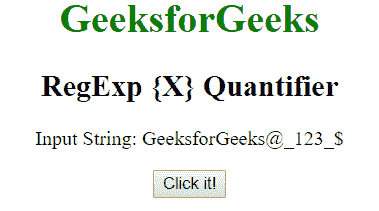
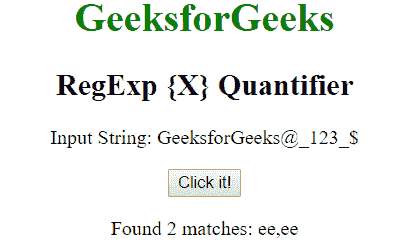
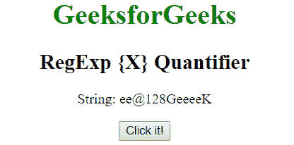
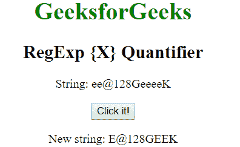

# JavaScript | RegExp {X}量化

> 哎哎哎:# t0]https://www . geeksforgeeks . org/JavaScript-regexp-x-quantizer-2/

JavaScript 中的 **RegExp m{X}量词**用于查找包含 m，X 次序列的任何字符串的匹配，其中 X 是一个数字。

**语法:**

```
/m{X}/ 
```

或者

```
new RegExp("m{X}")
```

**带修饰符的语法:**

```
/\m{X}/g 
```

或者

```
new RegExp("m{X}", "g")
```

**示例 1:** 此示例匹配整个字符串中单词“ee”的存在。

```
<!DOCTYPE html>
<html>

<head>
    <title>
        JavaScript RegExp {X} Quantifier
    </title>
</head>

<body style="text-align:center">

    <h1 style="color:green">GeeksforGeeks</h1>

    <h2>RegExp {X} Quantifier</h2>

    <p>Input String: GeeksforGeeks@_123_{content}lt;/p>

    <button onclick="geek()">Click it!</button>

    <p id="app"></p>

    <script>
        function geek() {
            var str1 = "GeeksforGeeks@_123_{content}quot;;
            var regex4 = /e{2}/gi;
            var match4 = str1.match(regex4);

            document.getElementById("app").innerHTML
                    = "Found " + match4.length
                    + " matches: " + match4;
        }
    </script>
</body>

</html>                    
```

**输出:**
**点击按钮前:**

**点击按钮后:**


**示例 2:** 本示例将单词“ee”替换为字符“E”。

```
<!DOCTYPE html>
<html>

<head>
    <title>
        JavaScript RegExp {X} Quantifier
    </title>
</head>

<body style="text-align:center">

    <h1 style="color:green">GeeksforGeeks</h1>

    <h2>RegExp {X} Quantifier</h2>

    <p>String: ee@128GeeeeK</p>

    <button onclick="geek()">Click it!</button>

    <p id="app"></p>

    <script>
        function geek() {
            var str1 = "ee@128GeeeeK";
            var regex4 = new RegExp("e{2}", "gi");         
            var replace = "E";
            var match4 = str1.replace(regex4, replace);
            document.getElementById("app").innerHTML
                = " New string: " + match4;
        }
    </script>
</body>

</html>                    
```

**输出:**
**点击按钮前:**

**点击按钮后:**


**支持的浏览器:**以下是 **RegExp {X}量词**支持的浏览器:

*   谷歌 Chrome
*   苹果 Safari
*   Mozilla Firefox
*   歌剧
*   微软公司出品的 web 浏览器