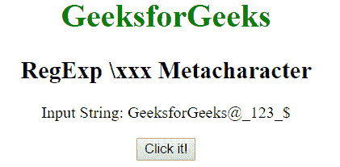
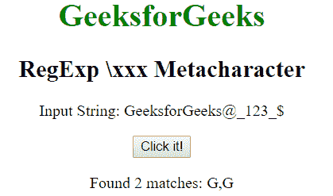
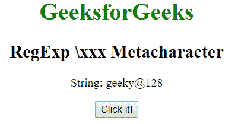
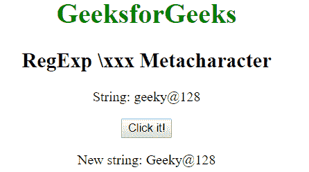

# JavaScript | RegExp \xxx 元字符

> 原文:[https://www . geesforgeks . org/JavaScript-regexp-XXX-meta character/](https://www.geeksforgeeks.org/javascript-regexp-xxx-metacharacter/)

JavaScript 中的 **RegExp \xxx 元字符**用于查找八进制数 xxx 指定的字符。如果找到匹配，则返回字符，否则返回空值。

**语法:**

```
/\xxx/ 
```

或者

```
new RegExp("\\xxx")
```

**带修饰符的语法:**

```
/\xxx/g 
```

或者

```
new RegExp("\\xxx", "g")
```

**示例 1:** 本示例返回八进制数 107 对应的字符，即整个字符串中的 G。

```
<!DOCTYPE html>
<html>

<head>
    <title>
        JavaScript RegExp \xxx Metacharacter
    </title>
</head>

<body style="text-align:center">

    <h1 style="color:green">
        GeeksforGeeks
    </h1>

    <h2>RegExp \xxx Metacharacter</h2>

    <p>Input String: GeeksforGeeks@_123_{content}lt;/p>

    <button onclick="geek()">
        Click it!
    </button>

    <p id="app"></p>

    <script>
        function geek() {
            var str1 = "GeeksforGeeks@_123_{content}quot;;
            var regex4 = /\107/gi;
            var match4 = str1.match(regex4);

            document.getElementById("app").innerHTML
                    = "Found " + match4.length
                    + " match: " + match4;
        }
    </script>
</body>

</html>                    
```

**输出:**
**点击按钮前:**

**点击按钮后:**


**例 2:** 本例匹配对应于“G”的八进制数(147)，并用“G”替换。

```
<!DOCTYPE html>
<html>

<head>
    <title>
        JavaScript RegExp \xxx Metacharacter
    </title>
</head>

<body style="text-align:center">

    <h1 style="color:green">
        GeeksforGeeks
    </h1>

    <h2>RegExp \xxx Metacharacter</h2>

    <p>String: geeky@128</p>

    <button onclick="geek()">
        Click it!
    </button>

    <p id="app"></p>

    <script>
        function geek() {
            var str1 = "geeky@128";
            var regex4 = new RegExp("\\147", "gi");         
            var replace = "G";
            var match4 = str1.replace(regex4, replace);
            document.getElementById("app").innerHTML = 
            " New string: " + match4;
        }
    </script>
</body>

</html>                    
```

**输出:**
**点击按钮前:**

**点击按钮后:**


**支持的浏览器:**下面列出了 **RegExp \xxx 元字符**支持的浏览器:

*   谷歌 Chrome
*   苹果 Safari
*   Mozilla Firefox
*   歌剧
*   微软公司出品的 web 浏览器