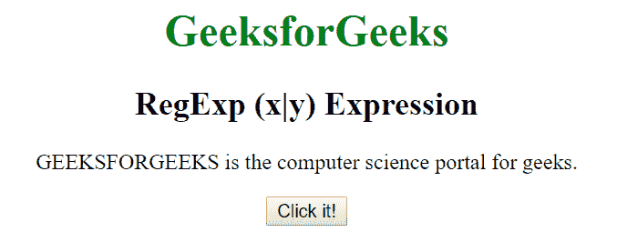
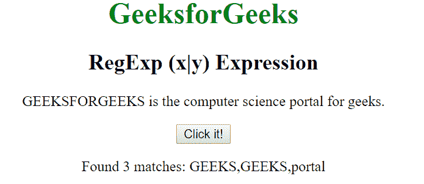
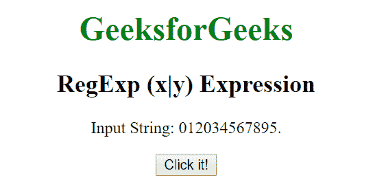
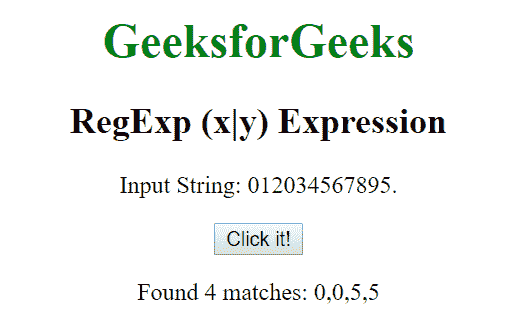

# JavaScript | RegExp (x|y)表达式

> 原文:[https://www . geesforgeks . org/JavaScript-regexp-xy-expression/](https://www.geeksforgeeks.org/javascript-regexp-xy-expression/)

JavaScript 中的**正则表达式(x|y)表达式**用于搜索任何指定的字符(用|分隔)。

**语法:**

```
/(x|y)/ 
```

或者

```
new RegExp("(x|y)")
```

**带修饰符的语法:**

```
/(x|y)/g 
```

或者

```
new RegExp("(x|y)", "g")
```

**示例 1:** 本示例在整个字符串中搜索单词“GEEKS”或“portal”。

```
<!DOCTYPE html>
<html>

<head>
    <title>
        JavaScript RegExp (x|y) Expression
    </title>    
</head>

<body style="text-align:center">

    <h1 style="color:green">
        GeeksforGeeks
    </h1>

    <h2>RegExp (x|y) Expression</h2>

    <p>
        GEEKSFORGEEKS is the computer science
        portal for geeks.
    </p>

    <button onclick="geek()">
        Click it!
    </button>

    <p id="app"></p>

    <script>
        function geek() {
           var str1 = "GEEKSFORGEEKS is the computer "
                    + "science portal for geeks.";

            var regex4 = /(GEEKS|portal)/g;
            var match4 = str1.match(regex4);

            document.getElementById("app").innerHTML = 
                    "Found " + match4.length
                    + " matches: " +  match4;
        }
    </script>
</body>

</html>
```

**输出:**

*   **点击按钮前:**
    
*   **点击按钮后:**
    

**示例 2:** 本示例搜索整个字符串中编号为 0 或 5 的数字。

```
<!DOCTYPE html>
<html>

<head>
    <title>
        JavaScript RegExp (x|y) Expression
    </title>    
</head>

<body style="text-align:center">

    <h1 style="color:green">
        GeeksforGeeks
    </h1>

    <h2>RegExp (x|y) Expression</h2>

    <p>Input String: 012034567895.</p>

    <button onclick="geek()">
        Click it!
    </button>

    <p id="app"></p>

    <script>
        function geek() {
           var str1 = "012034567895";
            var regex4 = /(0|5)/g;
            var match4 = str1.match(regex4);

            document.getElementById("app").innerHTML = 
                        "Found " + match4.length
                        + " matches: " +  match4;
        }
    </script>
</body>

</html>
```

**输出:**

*   **点击按钮前:**
    
*   **点击按钮后:**
    

**支持的浏览器:**下面列出了**正则表达式**支持的浏览器:

*   谷歌 Chrome
*   苹果 Safari
*   Mozilla Firefox
*   歌剧
*   微软公司出品的 web 浏览器