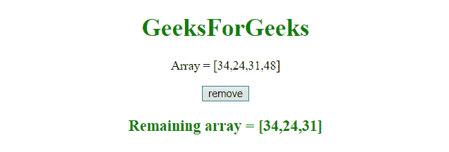

# JavaScript |从数组中移除最后一项

> 原文:[https://www . geesforgeks . org/JavaScript-从数组中移除最后一项/](https://www.geeksforgeeks.org/javascript-remove-the-last-item-from-an-array/)

任务是从数组中移除最后一项。这里讨论了一些最优选的方法。
首先要了解的几个功能。

*   **JavaScript Array splice() method**
    This method adds/deletes items to/from the array, and returns the deleted item(s).
    **Syntax:**

    ```
    array.splice(index, number, item1, ....., itemN)

    ```

    **参数:**

    *   **索引:**此参数为必选项。它指定在什么位置添加/删除项目的整数，负值用于指定从数组末尾的位置。
    *   **编号:**此参数为可选。它指定要删除的项目数。0 表示没有要移除的内容。
    *   **第 1 项，…..，itemN:** 此参数可选。这指定了要添加到
        数组中的新项目。

    **返回值:**
    返回一个新的数组，包含移除的项目。

*   **JavaScript Array slice()方法**
    这个方法返回一个包含所选元素的新数组。
    该方法选择的元素从给定的 start 参数开始，到结束，但不包括给定的 end 参数。
    **语法:**

    ```
    array.slice(start, end)

    ```

    **参数:**

    *   **开始:**此参数为可选。它指定从何处开始选择的整数(第一个元素在索引 0 处)。负数用于从数组末尾进行选择。如果不使用，它的行为就像“0”
    *   **结束:**此参数为可选。它指定结束选择的整数。如果不使用，从数组开始到结束的所有元素都将包含在选择中。负数用于从末尾开始选择。

    **返回值:**
    返回一个新数组，包含所选项目。

*   **JavaScript Array pop()方法**
    该方法删除数组的最后一个元素，并返回该元素。
    **语法:**

    ```
    array.pop()

    ```

    **返回值:**
    返回移除的数组项。数组项可以是字符串、数字、数组、布尔值或适用于数组的任何其他对象类型。

    **示例 1:** 本示例使用**拼接()方法**从数组中移除最后一项。

    ```
    <!DOCTYPE HTML>
    <html>

    <head>
        <title>
            JavaScript 
          | Remove last item from array.
        </title>
    </head>

    <body style="text-align:center;"
          id="body">
        <h1 style="color:green;">  
                GeeksForGeeks  
            </h1>
        <p id="GFG_UP"
           style="font-size: 16px;">
        </p>
        <button onclick="gfg_Run()">
            remove
        </button>
        <p id="GFG_DOWN"
           style="color:green; 
                  font-size: 20px;
                  font-weight: bold;">
        </p>
        <script>
            var el_up = 
                document.getElementById("GFG_UP");
            var el_down = 
                document.getElementById("GFG_DOWN");
            var array = [34, 24, 31, 48];
            el_up.innerHTML = "Array = [" + array + "]";

            function gfg_Run() {
                array.splice(-1, 1);
                el_down.innerHTML = 
                  "Remaining array = [" + array + "]";
            }
        </script>
    </body>

    </html>
    ```

    **输出:**

    *   **点击按钮前:**
        
    *   **点击按钮后:**
        

    **示例 2:** 本示例使用 **pop()方法**从数组中移除最后一项。

    ```
    <!DOCTYPE HTML>
    <html>

    <head>
        <title>
            JavaScript 
          | Remove last item from array.
        </title>
    </head>

    <body style="text-align:center;" 
          id="body">
        <h1 style="color:green;">  
                GeeksForGeeks  
            </h1>
        <p id="GFG_UP" 
           style="font-size: 16px;">
        </p>
        <button onclick="gfg_Run()">
            remove
        </button>
        <p id="GFG_DOWN" 
           style="color:green;
                  font-size: 20px; 
                  font-weight: bold;">
        </p>
        <script>
            var el_up = 
                document.getElementById("GFG_UP");
            var el_down = 
                document.getElementById("GFG_DOWN");
            var array = [34, 24, 31, 48];
            el_up.innerHTML = "Array = [" + array + "]";

            function gfg_Run() {
                array.pop();
                el_down.innerHTML = 
                  "Remaining array = [" + array + "]";
            }
        </script>
    </body>

    </html>
    ```

    **输出:**

    *   **点击按钮前:**
        
    *   **点击按钮后:**
        

    **示例 3:** 本示例不移除数组中的最后一项，而是使用**拼接()方法**返回一个移除了该项的新数组。

    ```
    <!DOCTYPE HTML>
    <html>

    <head>
        <title>
            JavaScript 
          | Remove last item from array.
        </title>
    </head>

    <body style="text-align:center;"
          id="body">
        <h1 style="color:green;">  
                GeeksForGeeks  
            </h1>
        <p id="GFG_UP" 
           style="font-size: 16px;">
        </p>
        <button onclick="gfg_Run()">
            remove
        </button>
        <p id="GFG_DOWN" 
           style="color:green; 
                  font-size: 20px; 
                  font-weight: bold;">
        </p>
        <script>
            var el_up = document.getElementById("GFG_UP");
            var el_down = document.getElementById("GFG_DOWN");
            var array = [34, 24, 31, 48];
            el_up.innerHTML = "Array = [" + array + "]";

            function gfg_Run() {
                el_down.innerHTML = 
                  "Remaining array = [" + array.slice(0, -1) + "]";
            }
        </script>
    </body>

    </html>
    ```

    **输出:**

    *   **点击按钮前:**
        
    *   **点击按钮后:**
        