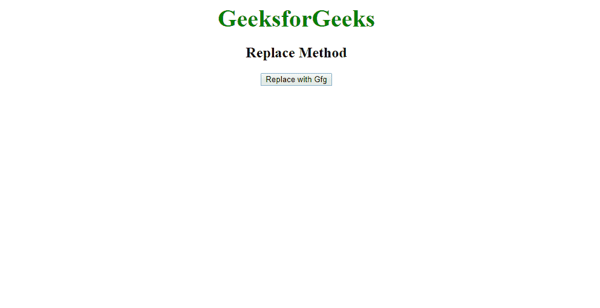
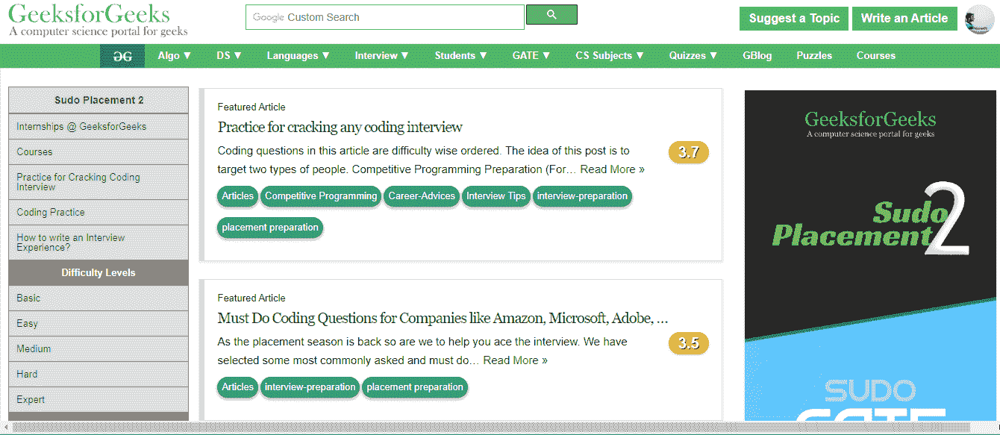

# JavaScript | Replace()方法

> 原文:[https://www.geeksforgeeks.org/javascript-replace-method/](https://www.geeksforgeeks.org/javascript-replace-method/)

JavaScript 中的 replace()方法用于将当前页面替换为另一个页面。替换方法用替换方法中提到的网址替换当前窗口的网址。

**语法:**

```
location.replace(URL)
```

**参数:**此方法接受单参数 *URL* 。网址是其他需要替换为旧页面的页面的参考。

**返回值:**此方法返回或在窗口中打开新页面。

**示例:**

```
<!DOCTYPE html>
<html>
     <head>
          <title>Redirect to Webpage</title>
          <style>
            body{
                text-align:center;
            }
            .gfg {
                font-size:40px;
                font-weight:bold;
                color:green;
            }
          </style>
     </head>
     <body>
     <div class = "gfg">GeeksforGeeks</div>
     <h2>Replace Method</h2>
     <button onclick = "Replace()" >Replace with Gfg</button>
          <script>

               //Replace function that replace the current page.
               function Replace() {
                    location.replace("https://www.geeksforgeeks.org/")
               }

          </script>
     </body>
</html>
```

**输出:**
**输出:-**
点击按钮前:

点击按钮后:
