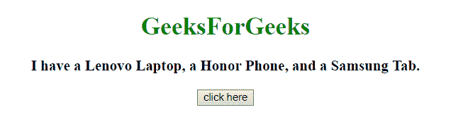
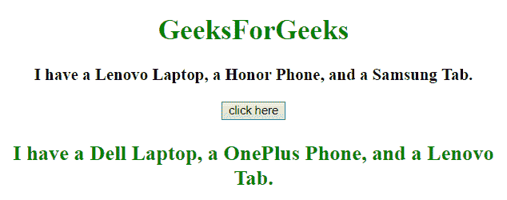

# JavaScript |用多个其他字符串替换多个字符串

> 原文:[https://www . geesforgeks . org/JavaScript-用多个其他字符串替换多个字符串/](https://www.geeksforgeeks.org/javascript-replace-multiple-strings-with-multiple-other-strings/)

给定一个有多个字符串的句子。任务是用新字符串同时替换多个字符串，而不是使用 javascript 逐个替换。
下面是几个可以理解的方法:

*   **replace() method**
    This method searches a string for a defined value, or a regular expression, and returns a new string with the replaced defined value.
    **Syntax:**

    ```
    string.replace(searchVal, newvalue)

    ```

    **参数:**

    *   **搜索值:**此参数为必填项。它指定将被新值替换的值或正则表达式。
    *   **新值:**此参数为必填项。它指定要替换搜索值的值。

    **返回值:**
    返回一个新字符串，其中定义的值已被新值替换。

*   **JavaScript Array join()方法**
    该方法将数组的元素添加到一个字符串中，并返回该字符串。
    元素将由一个传递的分隔符分隔。默认分隔符是逗号(，)。
    **语法:**

```
array.join(separator)

```

**参数:**

*   **分隔符:**此参数为可选。它指定要使用的分隔符。如果不使用，元素用逗号分隔

**返回值:**
返回一个字符串，表示数组值，用定义的分隔符隔开。

**示例 1:** 本示例使用 **replace()** 方法，使用 RegExp 根据对象替换字符串。

```
<!DOCTYPE html>  
<html>

<head>
    <title>
        JavaScript | Replace multiple strings with multiple other strings.
    </title>
</head>

<body style="text-align:center;" id="body">
    <h1 style="color:green;">GeeksForGeeks</h1>
    <p id="GFG_UP" style="font-size: 19px; font-weight: bold;">
    </p>
    <button onClick="GFG_Fun()">
        click here
    </button>
    <p id="GFG_DOWN" style="color: green; font-size: 24px; font-weight: bold;">
    </p>
    <script>
        var up = document.getElementById('GFG_UP');
        var down = document.getElementById('GFG_DOWN');
        var str = "I have a Lenovo Laptop, a Honor Phone, and a Samsung Tab.";
        var Obj = {
            Lenovo: "Dell",
            Honor: "OnePlus",
            Samsung: "Lenovo"
        };
        up.innerHTML = str;

        function GFG_Fun() {
            down.innerHTML = str.replace(/Lenovo|Honor|Samsung/gi, function(matched){
                return Obj[matched];
            });
        }
    </script>
</body>

</html>
```

**输出:**

*   **点击按钮前:**
    
*   **点击按钮后:**
    

**示例 2:** 本示例首先创建一个正则表达式，然后使用 **replace()** 方法用新的关键字替换特定的关键字。

```
<!DOCTYPE HTML>
<html>

<head>
    <title>
        JavaScript | Replace multiple strings with multiple other strings.
    </title>
</head>

<body style="text-align:center;" id="body">
    <h1 style="color:green;">  
            GeeksForGeeks  
        </h1>
    <p id="GFG_UP" style="font-size: 19px; font-weight: bold;">
    </p>
    <button onClick="GFG_Fun()">
        click here
    </button>
    <p id="GFG_DOWN" style="color: green; font-size: 24px; font-weight: bold;">
    </p>
    <script>
        var up = document.getElementById('GFG_UP');
        var down = document.getElementById('GFG_DOWN');
        var str = "I have a Lenovo Laptop, a Honor Phone, and a Samsung Tab.";
        var Obj = {
            Lenovo: "Dell",
            Honor: "OnePlus",
            Samsung: "Lenovo"
        };
        up.innerHTML = str;

        function GFG_Fun() {
            var RE = new RegExp(Object.keys(Obj).join("|"), "gi");
            down.innerHTML = str.replace(RE, function(matched) {
                return Obj[matched];
            });
        }
    </script>
</body>

</html>
```

**输出:**

*   **点击按钮前:**
    
*   **点击按钮后:**
    