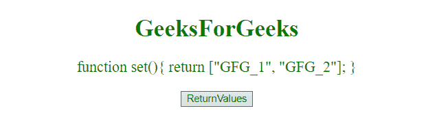
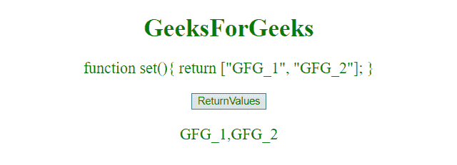
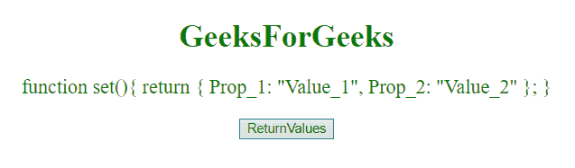
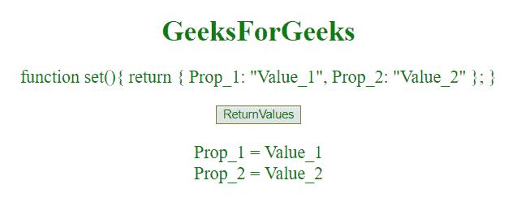

# JavaScript |从函数

返回多个值

> 原文:[https://www . geesforgeks . org/JavaScript-return-multiple-values-from-function/](https://www.geeksforgeeks.org/javascript-return-multiple-values-from-function/)

为了从一个函数返回多个值，我们不能直接返回它们。但是我们可以以数组和对象的形式返回它们。

**示例 1:** 本示例返回包含多个值的数组**[“GFG _ 1”、“GFG _ 2”]**。

```
<!DOCTYPE html> 
<html> 
    <head> 
        <title> 
            JavaScript | Return multiple
            values from function
        </title>
    </head> 

    <body style = "text-align:center;"> 

        <h1 style = "color:green;" > 
            GeeksForGeeks 
        </h1> 

        <p id="GFG_UP" style="color:green;font-size: 20px;"></p>

        <button id="GFG_Button" onclick = "returnVal()">
            ReturnValues
        </button> 

        <p id = "GFG_P" style = "color:green; font-size: 20px;"></p>

        <script>
            var up = document.getElementById("GFG_UP");
            var down = document.getElementById("GFG_P");

            function set(){

                return ["GFG_1", "GFG_2"];
            }

            up.innerHTML = set;

            function returnVal() {
                down.innerHTML = set();
            }
        </script> 
    </body> 
</html>                    
```

**输出:**

*   **点击按钮前:**
    
*   **点击按钮后:**
    

**例 2:** 本例返回对象**返回{ Prop _ 1:“Value _ 1”，Prop _ 2:“Value _ 2”}；**包含多个值。

```
<!DOCTYPE html> 
<html> 
    <head> 
        <title> 
            JavaScript | Return multiple
            values from function
        </title>
    </head> 

    <body style = "text-align:center;"> 

        <h1 style = "color:green;" > 
            GeeksForGeeks 
        </h1> 
        <p id = "GFG_UP" style = "color:green; font-size: 20px;"></p>

        <button id="GFG_Button" onclick = "returnVal()">
            ReturnValues
        </button> 

        <p id = "GFG_P" style = "color:green; font-size: 20px;"></p>

        <script>
            var up = document.getElementById("GFG_UP");
            var down = document.getElementById("GFG_P");

            function set() {

                return {
                    Prop_1: "Value_1",
                    Prop_2: "Value_2"
                };
            }

            up.innerHTML = set;

            function returnVal() {
                var val = set();
                down.innerHTML = "Prop_1 = " + val['Prop_1'] 
                        + "<br>Prop_2 = " + val['Prop_2'];
            }
        </script> 
    </body> 
</html>                    
```

**输出:**

*   **点击按钮前:**
    
*   **点击按钮后:**
    