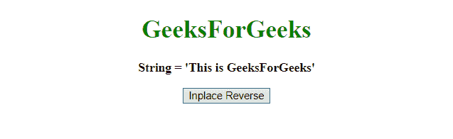
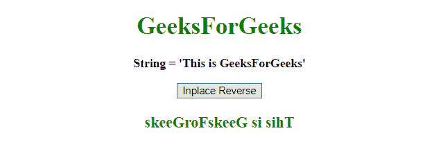
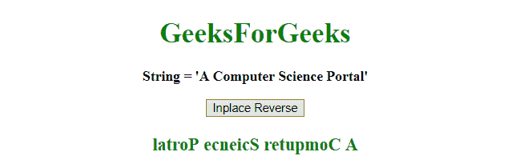

# JavaScript |将字符串反转到位。

> 原文:[https://www . geesforgeks . org/JavaScript-reverse-a-string-in-place/](https://www.geeksforgeeks.org/javascript-reverse-a-string-in-place/)

为了在适当的位置反转字符串，我们将使用许多方法和最喜欢的方法。
我们将使用这些方法(点击了解更多)。

*   **[【分裂()](https://www.geeksforgeeks.org/javascript-string-prototype-split-function/)**
*   **[【逆()](https://www.geeksforgeeks.org/javascript-array-prototype-reverse/)**
*   **[加入()](https://www.geeksforgeeks.org/javascript-array-join-method/)**
*   **基底()T3**

**例-1:** 本例通过先用 **("")** 分隔符将弦分开，然后反转，最后用 **("")** 分隔符连接来反转弦。

```
<!DOCTYPE html>
<html>

<head>
    <title>
        JavaScript |
      Reverse a string in place.
    </title>
</head>

<body style="text-align:center;" id="body">
    <h1 style="color:green;">  
            GeeksForGeeks  
        </h1>
    <p id="GFG_UP" 
       style="font-size: 16px; font-weight: bold;">
    </p>
    <button onclick="gfg_Run()">
        Inplace Reverse
    </button>
    <p id="GFG_DOWN" 
       style="color:green; 
              font-size: 20px; 
              font-weight: bold;">
    </p>
    <script>
        var el_up = document.getElementById("GFG_UP");
        var el_down = document.getElementById("GFG_DOWN");
        var str = 'This is GeeksForGeeks';
        el_up.innerHTML = "String = " + "'" + str + "'";

        function gfg_Run() {
            el_down.innerHTML = str.split("").reverse().join("");
        }
    </script>
</body>

</html>
```

**输出:**

*   **点击按钮前:**
    
*   **点击按钮后:**
    

**示例-2:** 本示例使用合并排序算法的概念。

```
<!DOCTYPE html>
<html>

<head>
    <title>
        JavaScript | Reverse a string in place.
    </title>
</head>

<body style="text-align:center;" id="body">
    <h1 style="color:green;">  
            GeeksForGeeks  
        </h1>
    <p id="GFG_UP"
       style="font-size: 16px;
              font-weight: bold;">
    </p>
    <button onclick="gfg_Run()">
        Inplace Reverse
    </button>
    <p id="GFG_DOWN" 
       style="color:green; font-size: 20px;
              font-weight: bold;">
    </p>
    <script>
        var el_up = document.getElementById("GFG_UP");
        var el_down = document.getElementById("GFG_DOWN");
        var str = 'This is GeeksForGeeks';
        el_up.innerHTML = "String = " + "'" + str + "'";

        function reverse(s) {
            if (s.length < 2)
                return s;
            var hIndex = Math.ceil(s.length / 2);
            return reverse(s.substr(hIndex)) +
                reverse(s.substr(0, hIndex));
        }

        function gfg_Run() {
            el_down.innerHTML = reverse(str);
        }
    </script>
</body>

</html>
```

**输出:**

*   **点击按钮前:**
    
*   **点击按钮后:**
    

**示例-3:** 本示例采用一个变量，并从字符串末尾追加结果。

```
<!DOCTYPE html>
<html>

<head>
    <title>
        JavaScript | Reverse a string in place.
    </title>
</head>

<body style="text-align:center;" id="body">
    <h1 style="color:green;">  
            GeeksForGeeks  
        </h1>
    <p id="GFG_UP" 
       style="font-size: 16px; 
              font-weight: bold;">
    </p>
    <button onclick="gfg_Run()">
        Inplace Reverse
    </button>
    <p id="GFG_DOWN" 
       style="color:green; 
              font-size: 20px; 
              font-weight: bold;">
    </p>
    <script>
        var el_up = document.getElementById("GFG_UP");
        var el_down = document.getElementById("GFG_DOWN");
        var str = 'A Computer Science Portal'
        el_up.innerHTML = "String = " + "'" + str + "'";

        function reverse(s {
            for(var i = s.length - 1, o = ''; i >= 0; o += s[i--])
                  {}
                return o;
            }

            function gfg_Run() {
                el_down.innerHTML = reverse(str);
            }
    </script>
</body>

</html>
```

**输出:**

*   **点击按钮前:**
    
*   **点击按钮后:**
    