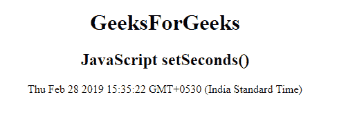
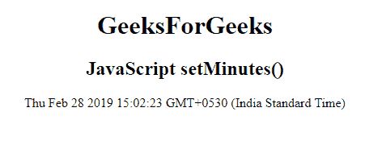
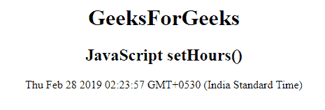
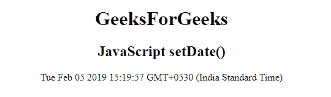
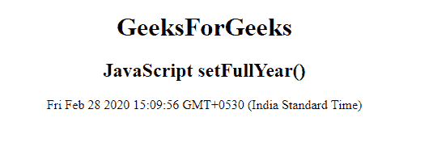
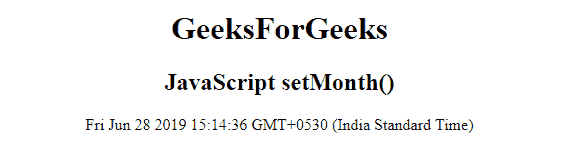

# JavaScript |设置日期方法

> 原文:[https://www.geeksforgeeks.org/javascript-set-date-methods/](https://www.geeksforgeeks.org/javascript-set-date-methods/)

在 JavaScript 中有各种方法来设置日期。对于日期对象，数据值可以设置为年、月、日、小时、分钟、秒、毫秒。

**方法:**

*   **setDate():** 用于将日期设置为数字(1-31)。
*   **setFullYear():** 用于设置年份(可选月、日)。
*   **设置小时():**用于设置小时(0-23)。
*   **设置毫秒():**用于设置毫秒(0-999)。
*   **设置分钟():**用于设置分钟(0-59)。
*   **设置月份():**用于设置月份(0-11)。
*   **设置秒():**用于设置秒(0-59)。
*   **setTime():** 用于设置时间。

*   **The setSeconds() Method:** The setSeconds() method sets the seconds of a date object (0-59).

    **示例:**

    ```
    <!DOCTYPE html>
    <html>

    <head> 
        <title>
            JavaScript setSeconds() method
        </title>
    </head> 

    <body style="text-align:center;">

        <h1>GeeksForGeeks</h1>

        <h2>JavaScript setSeconds()</h2>

        <p id="GFG"></p>

        <!-- Script to use setSeconds method -->
        <script>
            var d = new Date();
            d.setSeconds(22);
            document.getElementById("GFG").innerHTML = d;
        </script>
    </body>

    </html>                    
    ```

    **输出:**
    

*   **The setMinutes() Method:** The setMinutes() method sets the minutes of a date object (0-59).

    **示例:**

    ```
    <!DOCTYPE html>
    <html>

    <head> 
        <title>
            JavaScript setMinutes() method
        </title>
    </head> 

    <body style="text-align:center;">

        <h1>GeeksForGeeks</h1>

        <h2>JavaScript setMinutes()</h2>

        <p id="GFG"></p>

        <!-- Script to use setMinutes method -->
        <script>
            var d = new Date();
            d.setMinutes(2);
            document.getElementById("GFG").innerHTML = d;
        </script>
    </body>

    </html>                    
    ```

    **输出:**
    

*   **The setHours() Method:** The setHours() method sets the hours of a date object (0-23).

    **示例:**

    ```
    <!DOCTYPE html>
    <html>

    <head> 
        <title>
            JavaScript setHours() method
        </title>
    </head> 

    <body style="text-align:center;">

        <h1>GeeksForGeeks</h1>

        <h2>JavaScript setHours()</h2>

        <p id="GFG"></p>

        <!-- Script to use setHours() method -->
        <script>
            var d = new Date();
            d.setHours(2);
            document.getElementById("GFG").innerHTML = d;
        </script>
    </body>

    </html>                    
    ```

    **输出:**
    

*   **The setDate() Method:** The setDate() method in JavaScript is used to set the day of a date object (1-31).

    **示例:**

    ```
    <!DOCTYPE html>
    <html>

    <head> 
        <title>
            JavaScript setDate() method
        </title>
    </head> 

    <body style="text-align:center;">

        <h1>GeeksForGeeks</h1>

        <h2>JavaScript setDate()</h2>

        <p id="GFG"></p>

        <!-- Script to use setDate method -->
        <script>
            var d = new Date();
            d.setDate(5);
            document.getElementById("GFG").innerHTML = d;
        </script>
    </body>

    </html>                    
    ```

    **输出:**
    

*   **The setFullYear() Method:** The setFullYear() method in JavaScript is used to set the year of a date object.

    **示例:**

    ```
    <!DOCTYPE html>
    <html>

    <head> 
        <title>
            JavaScript setFullYear() method
        </title>
    </head> 

    <body style="text-align:center;">

        <h1>GeeksForGeeks</h1>

        <h2>JavaScript setFullYear()</h2>

        <p id="GFG"></p>

        <!-- Script to use setFullYear method -->
        <script>
            var d = new Date();
            d.setFullYear(2020);
            document.getElementById("GFG").innerHTML = d;
        </script>
    </body>

    </html>                    
    ```

    **输出:**
    

*   **The setMonth() Method:** The setMonth() method in JavaScript is used to set the month of a date object (0-11).

    **示例:**

    ```
    <!DOCTYPE html>
    <html>

    <head> 
        <title>
            JavaScript setMonth() method
        </title>
    </head> 

    <body style="text-align:center;">

        <h1>GeeksForGeeks</h1>

        <h2>JavaScript setMonth()</h2>

        <p id="GFG"></p>

        <!-- Script to use setMonth method -->
        <script>
            var d = new Date();
            d.setMonth(5);
            document.getElementById("GFG").innerHTML = d;
        </script>
    </body>

    </html>                    
    ```

    **输出:**
    