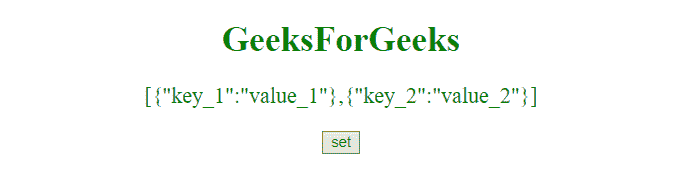
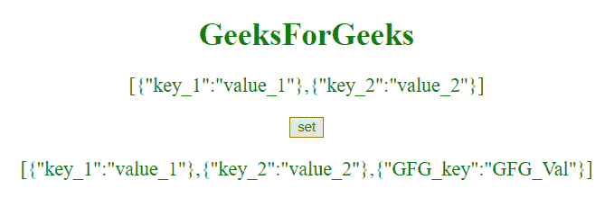
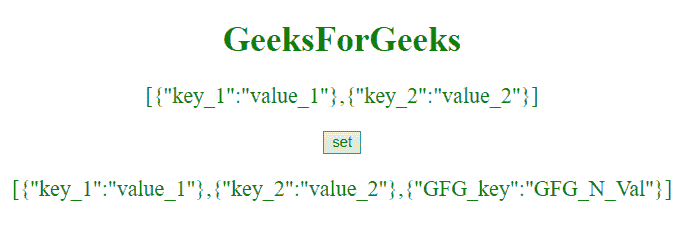

# JavaScript |通过变量设置对象键

> 原文:[https://www . geesforgeks . org/JavaScript-set-object-key-by-variable/](https://www.geeksforgeeks.org/javascript-set-object-key-by-variable/)

为了通过变量设置对象的键，下面是几个步骤。
**步骤:**

*   首先做一个变量。
*   然后做一个物体。
*   给变量赋值。

以下是几个例子。
**示例-1:** 本示例通过变量**键**设置对象键，然后将**{“GFG _ 键”:“GFG _ 瓦尔”}** 对象插入数组。

```
<!DOCTYPE html>
<html>

<head>
    <title>
        JavaScript | Set object key by variable
    </title>

</head>

<body style="text-align:center;">

    <h1 style="color:green;">  
            GeeksForGeeks  
        </h1>
    <p id="GFG_UP"
       style="color:green;
              font-size: 20px;">
    </p>

    <button id="GFG_Button" 
            onclick="set()">
      set
  </button>
    <p id="GFG_P" 
       style="color:green;
              font-size: 20px;">
    </p>
    <script>
        myArray = [{
            'key_1': 'value_1'
        }, {
            'key_2': 'value_2'
        }];
        var up = 
            document.getElementById("GFG_UP");

        up.innerHTML = 
          JSON.stringify(myArray);

        var down = 
            document.getElementById("GFG_P");

        function set() {

            var key = "GFG_key";
            var obj = {};
            obj[key] = "GFG_Val";
            myArray.push(obj);
            down.innerHTML = JSON.stringify(myArray);
        }
    </script>
</body>

</html>
```

**输出:**

*   **点击按钮前:**
    
*   **点击按钮后:**
    

**示例-2:** 本示例通过变量**键**设置对象键，并通过变量**值**设置对象值，然后将**{“GFG _ 键”:“GFG _ N _ 瓦尔”}** 对象插入到数组中。

```
<!DOCTYPE html>
<html>

<head>
    <title>
        JavaScript | Set object key by variable
    </title>

</head>

<body style="text-align:center;">

    <h1 style="color:green;">  
            GeeksForGeeks  
        </h1>
    <p id="GFG_UP"
       style="color:green; 
              font-size: 20px;">
    </p>

    <button id="GFG_Button"
            onclick="set()">
      set
  </button>
    <p id="GFG_P"
       style="color:green;
              font-size: 20px;">
    </p>
    <script>
        myArray = [{
            'key_1': 'value_1'
        }, {
            'key_2': 'value_2'
        }];
        var up = document.getElementById("GFG_UP");
        up.innerHTML = JSON.stringify(myArray);
        var down = document.getElementById("GFG_P");

        function set() {

            var key = "GFG_key";
            var obj = {};
            var val = "GFG_N_Val";
            obj[key] = val;
            myArray.push(obj);
            down.innerHTML = JSON.stringify(myArray);
        }
    </script>
</body>

</html>
```

**输出:**

*   **点击按钮前:**
    
*   **点击按钮后:**
    