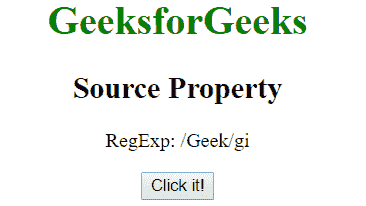
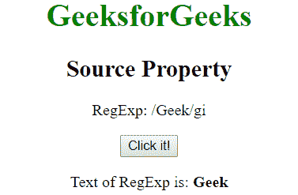

# JavaScript |源属性

> 原文:[https://www.geeksforgeeks.org/javascript-source-property/](https://www.geeksforgeeks.org/javascript-source-property/)

JavaScript 中的**源属性**用于返回 RegExp 模式文本的文本。
**语法:**

```
RegExpObject.source
```

其中**rexep**指正则表达式。
**示例:**此示例返回文本“极客”。

```
<!DOCTYPE html>
<html>
    <body style="text-align:center">
        <h1 style="color:green">GeeksforGeeks</h1>
        <h2>Source Property</h2>
        <p>RegExp: /Geek/gi</p>
        <button onclick="geek()">Click it!</button>
        <p id="app"></p>
        <script>
        function geek() {
            var patt1 = /Geek/gi;
            var res 
            = "Text of RegExp is: " +  "<b>" + patt1.source + "</b>";
          document.getElementById("app").innerHTML =  res ;
        </script>
    </body>
</html>
```

**输出:**
**点击按钮前:**

**点击按钮后:**

**支持的浏览器:**JavaScript 源码属性支持的浏览器如下:

*   谷歌 Chrome
*   苹果 Safari
*   Mozilla Firefox
*   歌剧
*   微软公司出品的 web 浏览器