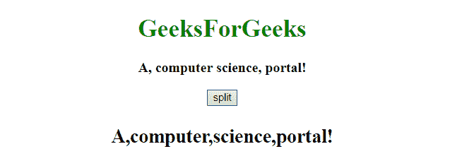
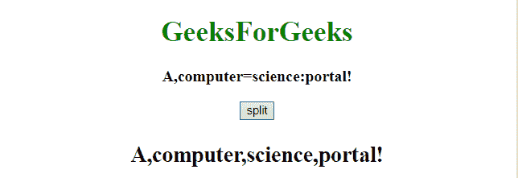

# JavaScript |用多个分隔符拆分字符串

> 原文:[https://www . geesforgeks . org/JavaScript-带多分隔符的拆分字符串/](https://www.geeksforgeeks.org/javascript-split-a-string-with-multiple-separators/)

给定包含字符串和分隔符的语句，任务是将字符串拆分为子字符串。
[**String split()方法**](https://www.geeksforgeeks.org/javascript-string-prototype-split-function/)**:**str . split()函数用于使用参数中提供的指定分隔符将给定的字符串分成子字符串，从而将其拆分为字符串数组。

**语法:**

```
str.split(separator, limit)
```

**参数:**该功能接受三个参数，如上所述，描述如下:

*   **字符串:**此参数保存要拆分的字符串。
*   **分隔符:**为可选参数。它定义了用于断开字符串的字符或正则表达式。如果不使用，则返回相同的字符串(单项数组)。
*   **极限:**为可选参数。它是一个整数，用于指定拆分的数量。限制后的所有项目都将被丢弃。

[**Array join()函数**](https://www.geeksforgeeks.org/javascript-array-prototype-join-function/)**:**Array . join()函数用于将数组中的元素连接成一个字符串。此方法将数组的元素添加到字符串中，并返回新创建的字符串。元素由特定的分隔符分隔。使用的默认分隔符是逗号(，)。

**语法:**

```
array.join(separator)
```

**参数:**该函数接受两个参数，如上所述，如下所述:

*   **阵:**要加入的阵。
*   **分隔符:**为可选参数。它指定要使用的分隔符。如果未通过，则使用默认的分隔符逗号。

**示例 1:** 本示例使用**通过 2 个分隔符**逗号(，**和**空格(')**分割字符串。split()** 功能。

## 超文本标记语言

```
<!DOCTYPE html>
<html>
    <head>
        <title>
            JavaScript | Split a string with
            multiple separators.
        </title>
    </head>

    <body style = "text-align:center;" id = "body">

        <h1 style = "color:green;" >
            GeeksForGeeks
        </h1>

        <p id="GFG_UP" style="font-size:18px; font-weight:bold;"></p>

        <button onclick = "gfg_Run()">
            split
        </button>

        <p id="GFG_DOWN" style="font-size:25px; font-weight:bold;"></p>

        <script>
            var el_up = document.getElementById("GFG_UP");
            var el_down = document.getElementById("GFG_DOWN");
            var str = "A, computer science, portal!";
            el_up.innerHTML = str;

            function gfg_Run() { 
                var arr = str.split(/[\s, ]+/)
                el_down.innerHTML = arr;    
            }
        </script>
    </body>
</html>                   
```

**输出:**

*   **点击按钮前:**


*   **点击按钮后:**



**示例 2:** 本示例使用多个**按分隔符(如**逗号(，，等号(=)** 和**冒号(:)**)的数量拆分字符串。加入()**和**。split()** 法。

## 超文本标记语言

```
<!DOCTYPE html>
<html>
    <head>
        <title>
            JavaScript | Split a string with
            multiple separators.
        </title>
    </head>

    <body style = "text-align:center;" id = "body">

        <h1 style = "color:green;" >
            GeeksForGeeks
        </h1>

        <p id = "GFG_UP" style = "font-size: 18px; font-weight: bold;">
        </p>

        <button onclick = "gfg_Run()">
            split
        </button>

        <p id = "GFG_DOWN" style = "font-size: 25px; font-weight: bold;">
        </p>

        <script>
            var el_up = document.getElementById("GFG_UP");
            var el_down = document.getElementById("GFG_DOWN");
            var str = "A, computer=science:portal!";
            el_up.innerHTML = str;

            function gfg_Run(){
                var arr =
                str.split('=').join(', ').split(':').join(', ').split(', ');
                el_down.innerHTML = arr;    
            }

        </script>
    </body>
</html>                   
```

**输出:**

*   **点击按钮前:**


*   **点击按钮后:**

