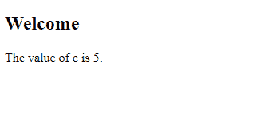
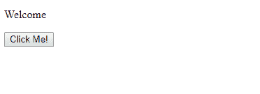
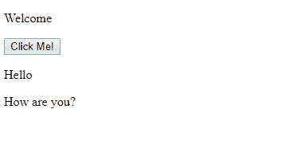

# JavaScript |语句

> 原文:[https://www.geeksforgeeks.org/javascript-statements/](https://www.geeksforgeeks.org/javascript-statements/)

用编程语言写在程序中的编程指令称为语句。

语句的执行顺序与它们的书写顺序相同。

1.  **分号:**
    *   **分号**分隔 JavaScript 语句。
    *   **Semicolon** marks the end of a statement in javascript.

        **示例:**

        ```
        <!DOCTYPE html>
        <html>

        <body>
            <h2>Welcome</h2>

            <p id="geek"></p>

            <script>
                // Statement 1
                var a, b, c;

                // Statement 2
                a = 2;

                // Statement 3
                b = 3;

                // Statement 4
                c = a + b;

                document.getElementById(
                  "geek").innerHTML =
                    "The value of c is " + c + ".";
            </script>

        </body>

        </html>
        ```

        **输出:**
        

    *   如果用分号分隔，一行中允许有多个语句。

        ```
        a=2;b=3;z=a+b;
        ```

2.  **代码块:**
    JavaScript 语句可以在花括号内组合在一起。这些组被称为**代码块**。分组的目的是定义要一起执行的语句。

**示例:** JavaScript 函数

```
<!DOCTYPE html>
<html>

<body>
    <p>Welcome</p>

    <button type="button" 
            onclick="myFunction()">
      Click Me!
  </button>

    <p id="geek1"></p>
    <p id="geek2"></p>

    <script>
        function myFunction() {

            document.getElementById(
              "geek1").innerHTML = "Hello";

            document.getElementById(
              "geek2").innerHTML = 
              "How are you?";
        }
    </script>

</body>

</html>
```

**输出:**
**点击前:**

**点击后:**


*   **White Space:**
    *   Javascript *忽略多个空格。*

    Javascript 会将以下两个语句视为相同:
    **示例:**

    ```
    var a="Hello Geek";
    var a = "Hello Geek";

    ```

    *   **行长和换行符:**
    大多数程序员首选的 Javascript 代码行长度高达 **80 个字符**。
    Javascript 中**断一个代码行**最好的地方，如果不符合，就是在一个操作符之后*。
    **例:**

    ```
    document.getElementById("geek1").innerHTML =
    "Hello Geek!";

    ```* *   **Keywords:**
    Keywords are reserved words and cannot be used as variable name.
    A Javascript keyword tells about what kind of operation it will perform.

    **一些常用的关键词有:**

    *   **断开:**用于终止回路或开关。
    *   **继续:**这用于跳过循环中的特定迭代，并移动到下一个迭代。
    *   **做…while:** 在这种情况下，执行 do 块中写入的语句，直到 while 中的条件为真。
    *   **for:** 它有助于执行一个语句块，直到条件为真。
    *   **函数:**这个关键字用来声明一个函数。
    *   **return:** 这个关键字是用来退出一个函数的。
    *   **var:** 这个关键字用来声明一个变量。
    *   **开关:**这有助于根据不同情况执行一组代码。