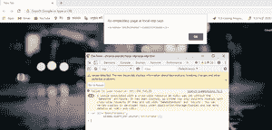

# JavaScript string.anchor()方法

> 原文:[https://www . geesforgeks . org/JavaScript-string-anchor-method/](https://www.geeksforgeeks.org/javascript-string-anchor-method/)

下面是 string.anchor()方法的示例。

*   **例 1:**

    ```
    <script> 
            var str="GFG"; 
            window.alert(str.anchor("anchorname")); 
    </script> 
    ```

*   **输出:**

    ```
    <a name="anchorname">GFG</a>
    ```

**anchor()** 方法创建一个用作超文本目标的 anchor 元素，这意味着当您在 JavaScript 中使用 anchor 方法时，anchor 方法会返回带有字符串的< a >元素，还会返回“anchorname”作为“name”属性的值，就像*这样:*

**语法:**

```
 string.anchor(anchorname)

```

**参数:**

*   **主播名:**主播的名字。
*   **返回值:****锚()**方法返回带有<一个>元素的字符串。

**JavaScript 版本:** JavaScript1.0

**示例 1:** 本示例向您展示了如何使用**锚()**方法。

```
<!DOCTYPE html>
<html>
<body>
  <script>
        var str="GeeksForGeeks";
        window.alert(str.anchor("anchorname"));
  </script>
</body>
</html>
```

**输出:**



**例 2:**

```
var str="GeeksForGeeks";
console.log(str.anchor("anchorname"));
```

**输出:**

```
<a name="anchorname">GeeksForGeeks</a>
```

**支持的浏览器:**

*   Chrome 1 及以上
*   边缘 12 及以上
*   Firefox 1 及以上版本
*   歌剧 3 及以上
*   Safari 1 及以上