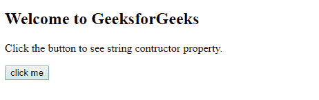
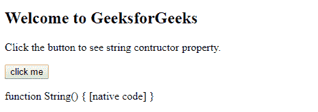

# JavaScript 字符串构造器属性

> 原文:[https://www . geesforgeks . org/JavaScript-string-constructor-property/](https://www.geeksforgeeks.org/javascript-string-constructor-property/)

下面是字符串构造函数属性的示例。

*   **例:**

    ```
    <script> 
    function func() { 

        var str = 'Geeks for Geeks'; 

        var value = str.constructor; 
        document.write(value); 
    } 
    func(); 
    </script> 
    ```

*   **输出:**

    ```
    function String() { [native code] }
    ```

JavaScript 中的字符串构造函数属性用于返回对象的字符串构造函数。此属性返回的函数只是对此函数的引用，而不是包含函数名称的字符串。JavaScript 数字构造函数、字符串构造函数和布尔构造函数分别返回 Number(){[本机代码] }、String(){[本机代码] }和 Boolean(){[本机代码] }函数。

**语法:**

```
string.constructor
```

**返回值:**函数字符串(){[本机代码] }

**示例:**

```
<!DOCTYPE html>
<html>

<head>
    <title>
        JavaScript String constructor Property
    </title>
</head>

<body>
    <h2>
        Welcome to GeeksforGeeks
    </h2>

    <p>
        Click the button to see string
        contructor property.
    </p>

    <button onclick="myGeeks()">
        click me
    </button>

    <p id="GFG"></p>

    <!--Script to use string constructor property-->
    <script>
        function myGeeks() {
            var str = "Hello World!";

            document.getElementById("GFG").innerHTML
                    = str.constructor;
        }
    </script>
</body>

</html>                    
```

**输出:**
**点击按钮前:**

**点击按钮后:**


**支持的浏览器:****字符串构造函数属性**支持的浏览器如下:

*   谷歌 Chrome
*   苹果 Safari
*   火狐浏览器
*   歌剧
*   边缘