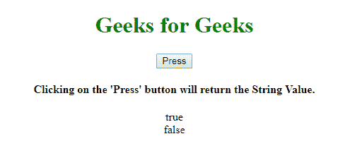
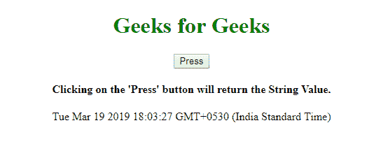

# JavaScript String()函数

> 原文:[https://www.geeksforgeeks.org/javascript-string-function/](https://www.geeksforgeeks.org/javascript-string-function/)

下面是 **String()函数**的例子。

*   **例:**

    ```
    <script>
        function gfg() {
            var geek = Boolean(1);
            var geeks = Boolean(0);

            var string =
                String(geek) + "<br>" +
                String(geeks);

            document.write(string);
        }
        gfg();
    </script>
    ```

*   **输出:**

    ```
    true
    false
    ```

**String()函数**用于将对象的值转换为字符串值。

**语法:**

```
String(object)
```

**参数值:**该函数接受如上所述的单个参数，如下所述:

*   **对象:**该参数包含一个字符串，该字符串被转换为字符串值。

**返回值:**返回字符串值。

**程序:**返回布尔的字符串值。

```
<!DOCTYPE html>
<html>

<body>
    <center>
        <h1 style="color:green;">
          Geeks for Geeks
        </h1>
        <button onclick="geek()">
          Press
        </button>
        <h4>
          Clicking on the 'Press' button
          will return the String Value.
        </h4>
        <p id="gfg"></p>

        <script>
            function geek() {
                var x = Boolean(1);
                var y = Boolean(0);

                var string =
                    String(x) + "<br>" +
                    String(y);

                document.getElementById(
                  "gfg").innerHTML = string;
            }
        </script>
    </center>
</body>

</html>
```

**输出:**


**程序 2:** 返回日期()对象的字符串值。

```
<!DOCTYPE html>
<html>

<body>
    <center>
        <h1 style="color:green;">
          Geeks for Geeks
      </h1>
        <button onclick="geek()">
          Press
      </button>
        <h4>Clicking on the 'Press'
          button will return the 
          String Value.
      </h4>

        <p id="gfg"></p>

        <script>
            function geek() {

                var y = Date();

                var string =
                    String(y);

                document.getElementById(
                  "gfg").innerHTML = string;
            }
        </script>
    </center>
</body>

</html>
```

**输出:**


**支持的浏览器:**

*   谷歌 Chrome
*   火狐浏览器
*   微软公司出品的 web 浏览器
*   歌剧
*   旅行队