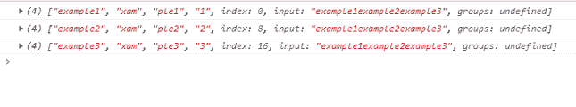

# Javascript 字符串 matchAll()方法

> 原文:[https://www . geesforgeks . org/JavaScript-string-match all-method/](https://www.geeksforgeeks.org/javascript-string-matchall-method/)

在 Javascript 中，*matcheall()*方法用于返回所有与引用字符串匹配的迭代器，这些迭代器与一个[正则表达式](https://www.geeksforgeeks.org/javascript-regular-expressions/#:~:text=Related%20Articles&text=Below%20is%20the%20example%20of%20the%20JavaScript%20Regular%20Expressions.&text=A%20regular%20expression%20is%20a,or%20a%20more%20complicated%20pattern.)(正则表达式)相匹配。 *matchAll()* 方法的一个重要用途是，它可以用来捕获带有/g 标志的组，这使它比忽略捕获带有/g 标志的组的 [*match()*](https://www.geeksforgeeks.org/javascript-match-function/) 方法更具优势。

#### 语法:

```
str.matchAll(Regexp)
```

*   **字符串:**是要找到匹配的参考字符串。
*   **Regexp:** 它只是一个正则表达式对象。RegExp 对象必须包含/g 标志，否则将引发[类型错误](https://www.geeksforgeeks.org/javascript-typeerror-cannot-use-in-operator-to-search-for-x-in-y/)。
*   **返回值:**是一个迭代器。

**示例:**

## 超文本标记语言

```
<html>
<body>
<script> 
function myFunction() { 

    //Regular expression with the /g flag
    const regex = /e(xam)(ple(\d?))/g;
    //Reference string
    const str = 'example1example2example3';

    //Using matchAll() method
    const array = [...str.matchAll(regex)];

    console.log(array[0]);
    console.log(array[1]);
    console.log(array[2]);
}  
myFunction(); 
</script> 
  </body>
</html>
```

**输出:**



在上面的例子中，当我们使用*matcheall()*方法时，我们能够找到匹配项并捕获内部组。