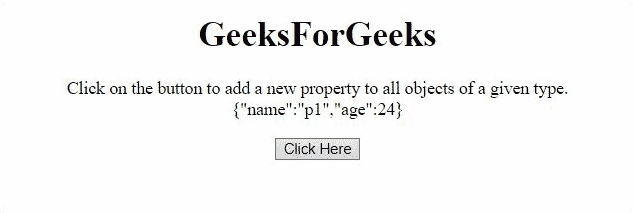
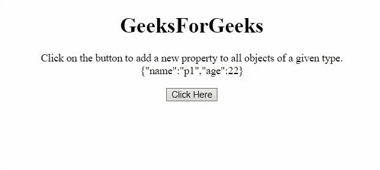

# JavaScript 字符串原型属性

> 原文:[https://www . geesforgeks . org/JavaScript-string-prototype-property/](https://www.geeksforgeeks.org/javascript-string-prototype-property/)

**原型**属性允许向现有的 JavaScript 对象类型添加新的属性和方法。有两个例子可以描述 JavaScript 字符串原型属性。

**语法:**

```html
object.prototype.name = value
```

**返回值:**返回对**字符串原型**对象的引用。

**示例 1:** 本示例将属性**工资**添加到所有对象中。

```html
<!DOCTYPE HTML>
<html>

<head>
    <title>
        JavaScript String prototype Property
    </title>
</head>

<body style="text-align:center;">

    <h1>GeeksForGeeks</h1>

    <p id="GFG_UP"></p>

    <button onclick="GFG_Fun();">
        Click Here
    </button>

    <p id="GFG_DOWN"></p>

    <script>
        var up = document.getElementById('GFG_UP');
        var down = document.getElementById('GFG_DOWN');

        function person(name, age) {
            this.name = name;
            this.age = age;
        }
        var p1 = new person("p1", 24);
        up.innerHTML = "Click on the button to add "
                + "a new property to all objects of"
                + " a given type.< br > " 
                + JSON.stringify(p1);

        function GFG_Fun() {
            person.prototype.salary = 1000;
            down.innerHTML = p1.salary;
        }
    </script>
</body>

</html> 
```

**输出:**


**示例 2:** 本示例向所有对象添加方法**信息**。

```html
<!DOCTYPE HTML>
<html>

<head>
    <title>
        JavaScript String prototype Property
    </title>
</head>

<body style="text-align:center;">

    <h1>GeeksForGeeks</h1>

    <p id="GFG_UP"></p>

    <button onclick="GFG_Fun();">
        Click Here
    </button>

    <p id="GFG_DOWN"></p>

    <script>
        var up = document.getElementById('GFG_UP');
        var down = document.getElementById('GFG_DOWN');
        function person(name, age) {
            this.name = name;
            this.age = age;
        }
        var p1 = new person("p1", 22);
        up.innerHTML = "Click on the button to add"
                + " a new property to all objects "
                + "of a given type.< br > " 
                + JSON.stringify(p1);

        function getData(name, age) {
            return "Information of person <br>Name - '" 
                        + name + "'<br>Age - " + age;
        }

        function GFG_Fun() {
            person.prototype.info 
                    = getData(p1.name, p1.age);

            down.innerHTML = p1.info;
        }
    </script>
</body>

</html> 
```

**输出:**
