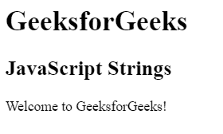
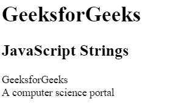
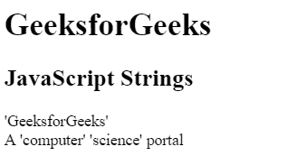
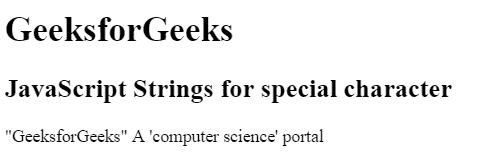
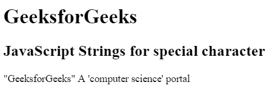
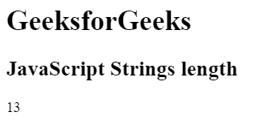
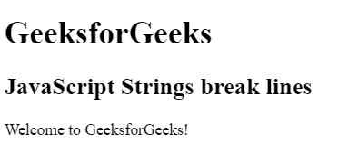
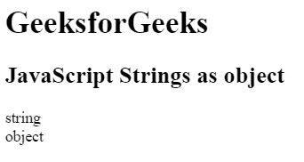

# JavaScript |字符串

> 原文:[https://www.geeksforgeeks.org/javascript-strings/](https://www.geeksforgeeks.org/javascript-strings/)

JavaScript 字符串用于存储和操作文本。引号中可以包含零个或多个字符。

**示例:**

```
<!DOCTYPE html>
<html>

<head>
    <title>
        JavaScript Strings
    </title>
</head>    

<body>

    <h1>GeeksforGeeks</h1>

    <h2>JavaScript Strings</h2>

    <p id="GFG"></p>

    <!-- Script to store string in variable -->
    <script>

        // String written inside quotes
        var x = "Welcome to GeeksforGeeks!"; 
        document.getElementById("GFG").innerHTML = x;
    </script>
</body>

</html>                    
```

**输出:**


**实现字符串的方法:**实现字符串的方法主要有两种，列举如下。

*   **Example 1:** Use either single or double quotes to write strings.

    ```
    <!DOCTYPE html>
    <html>

    <head>
        <title>
            JavaScript Strings
        </title>
    </head>    

    <body>

        <h1>GeeksforGeeks</h1>

        <h2>JavaScript Strings</h2>

        <p id="GFG"></p>

        <!-- Script to initialize string -->
        <script>
            var x = "GeeksforGeeks";
            var y = 'A computer science portal';

            document.getElementById("GFG").innerHTML =
                        x + "<br>" + y; 
        </script>
    </body>

    </html>                    
    ```

    **输出:**
    

*   **Example 2:** Quotes can be used inside a string, as long as they don’t match the quotes surrounding the string.

    ```
    <!DOCTYPE html>
    <html>

    <head>
        <title>
            JavaScript Strings
        </title>
    </head>    

    <body>

        <h1>GeeksforGeeks</h1>

        <h2>JavaScript Strings</h2>

        <p id="GFG"></p>

        <script>
            var x = "'GeeksforGeeks'";
            var y = "A 'computer' 'science' portal";

            document.getElementById("GFG").innerHTML =
                        x + "<br>" + y; 
        </script>
    </body>

    </html>                                
    ```

    **输出:**
    

**特殊字符:**如上所述，特殊字符不能在一个字符串中使用相同类型的引号，但是有一个解决方案。它使用反斜杠转义字符。反斜杠“\”转义字符将特殊字符转换为普通字符串字符。序列(\ ")用于在字符串中插入双引号。

*   **Example:**

    ```
    <!DOCTYPE html>
    <html>

    <head>
        <title>
            JavaScript Strings
        </title>
    </head>    

    <body>

        <h1>GeeksforGeeks</h1>

        <h2>JavaScript Strings for special character</h2>

        <p id="GFG"></p>

        <!-- Script to use special character -->
        <script>
            var x = "\"GeeksforGeeks\" A \'computer science\' portal";

            document.getElementById("GFG").innerHTML = x; 
        </script>
    </body>

    </html>                       
    ```

    **输出:**
    

*   **Example:** String can be written within single quote.

    ```
    <!DOCTYPE html>
    <html>

    <head>
        <title>
            JavaScript Strings
        </title>
    </head>    

    <body>

        <h1>GeeksforGeeks</h1>

        <h2>JavaScript Strings for special character</h2>

        <p id="GFG"></p>

        <!-- Script to use special character -->
        <script>
            var x = '\"GeeksforGeeks\" A \'computer science\' portal';

            document.getElementById("GFG").innerHTML = x; 
        </script>
    </body>

    </html>                          
    ```

    **输出:**
    

**字符串长度:**使用**长度**属性可以找到字符串的长度。

**示例:**

```
<!DOCTYPE html>
<html>

<head>
    <title>
        JavaScript Strings
    </title>
</head>    

<body>

    <h1>GeeksforGeeks</h1>

    <h2>JavaScript Strings length</h2>

    <p id="GFG"></p>

    <!-- Script to return the length of string -->
    <script>
        var len = "GeeksforGeeks"; 

        // Returns the length of string
        document.getElementById("GFG").innerHTML
                = len.length;
    </script>
</body>

</html>                    
```

**输出:**


**断弦:**有时为了便于理解，我们需要对弦进行分割，可以使用符号 **\** ，但不是首选。首选方法是在两个字符串之间使用 **+** 符号。

**示例:**

```
<!DOCTYPE html>
<html>

<head>
    <title>
        JavaScript Strings
    </title>
</head>    

<body>

    <h1>GeeksforGeeks</h1>

    <h2>JavaScript Strings break lines</h2>

    <p id="GFG"></p>

    <!-- Script to break the line -->
    <script>
        document.getElementById("GFG").innerHTML = "Welcome" 
                    + " to GeeksforGeeks!";
    </script>
</body>

</html>                    
```

**输出:**


**字符串作为对象:**使用关键字“new”可以将字符串用作对象。

**示例:**

```
<!DOCTYPE html>
<html>

<head>
    <title>
        JavaScript Strings
    </title>
</head>    

<body>

    <h1>GeeksforGeeks</h1>

    <h2>JavaScript Strings as object</h2>

    <p id="GFG"></p>

    <!-- Script to use string as object -->
    <script>

        // Declare a string
        var x = "Great Geek";     

        // Declare an object
        var y = new String("Great Geek"); 

        document.getElementById("GFG").innerHTML =
                typeof x + "<br>" + typeof y;
    </script>
</body>

</html>                    
```

**输出:**
