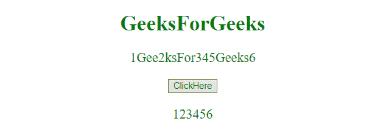
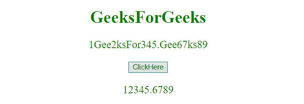

# JavaScript |从字符串中去除所有非数字字符

> 原文:[https://www . geesforgeks . org/JavaScript-strip-all-non-numeric-characters-from-string/](https://www.geeksforgeeks.org/javascript-strip-all-non-numeric-characters-from-string/)

为了删除字符串中的所有非数字字符，使用了 **replace()** 函数。
**replace()函数:**该函数在字符串中搜索特定的值或正则表达式，并在完成替换的地方返回一个新字符串。

**语法:**

```
string.replace( searchVal, newValue )
```

**参数:**该函数接受两个参数，如上所述，如下所述:

*   **searchVal:** 必选参数。它指定将被新值替换的值或正则表达式。
*   **新值:**必选参数。它指定要由搜索值替换的值。

**示例 1:** 本示例在**正则表达式**的帮助下，从字符串**‘1 gee2k for 345 geek 6’**中去除所有非数字字符。

## 超文本标记语言

```
<!DOCTYPE html>
<html>
    <head>
        <title>
            JavaScript | Strip all non-numeric
            characters from string
        </title>
    </head>

    <body style = "text-align:center;">

        <h1 style = "color:green;" >
            GeeksForGeeks
        </h1>

        <p id = "GFG_UP" style = "color:green; font-size: 20px;"></p>

        <button id="GFG_Button" onclick = "stripValues()">
            ClickHere
        </button>

        <p id = "GFG_P" style = "color:green; font-size: 20px;"></p>

        <script>
            var up = document.getElementById("GFG_UP");
            var down = document.getElementById("GFG_P");
            var str = "1Gee2ksFor345Geeks6";
            up.innerHTML = str;

            function stripValues() {
                down.innerHTML = str.replace(/\D/g,'');
            }
        </script>
    </body>
</html>                   
```

**输出:**

*   **点击按钮前:**


*   **点击按钮后:**



**示例 2:** 本示例从字符串**1 gee2ksfor 345 中删除所有非数字字符。在 **RegExp** 的帮助下，Gee67ks89'** 。本示例保留浮点数。

## 超文本标记语言

```
<!DOCTYPE html>
<html>
    <head>
        <title>
            JavaScript | Strip all non-numeric
            characters from string
        </title>
    </head>

    <body style = "text-align:center;">

        <h1 style = "color:green;" >
            GeeksForGeeks
        </h1>
        <p id = "GFG_UP" style = "color:green; font-size: 20px;"></p>

        <button id="GFG_Button" onclick = "stripValues()">
            ClickHere
        </button>

        <p id = "GFG_P" style = "color:green; font-size: 20px;"></p>

        <script>
            var up = document.getElementById("GFG_UP");
            var down = document.getElementById("GFG_P");
            var str = "1Gee2ksFor345.Gee67ks89";
            up.innerHTML = str;

            function stripValues() {
                down.innerHTML = str.replace(/[^\d.-]/g, '');
            }
        </script>
    </body>
</html>                   
```

**输出:**

*   **点击按钮前:**


*   **点击按钮后:**

