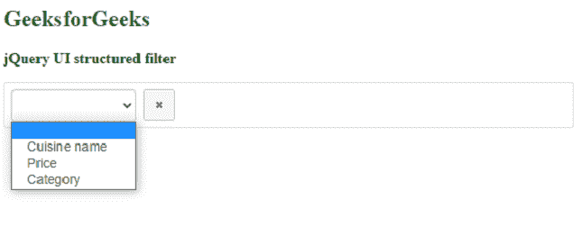
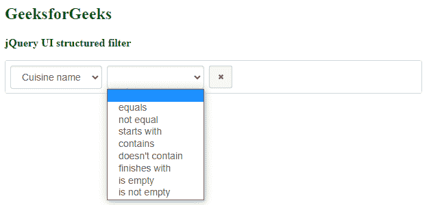
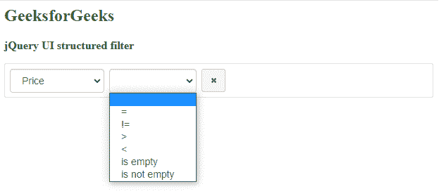
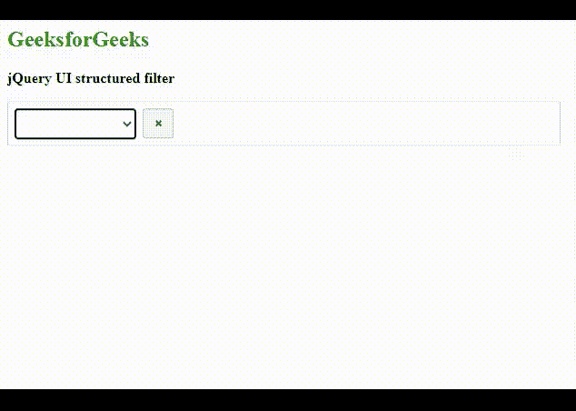
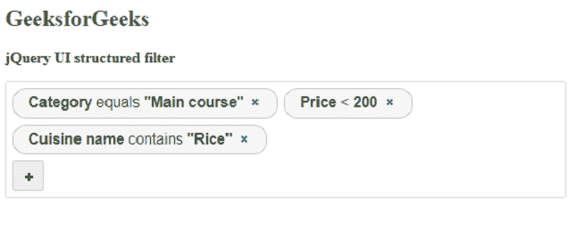
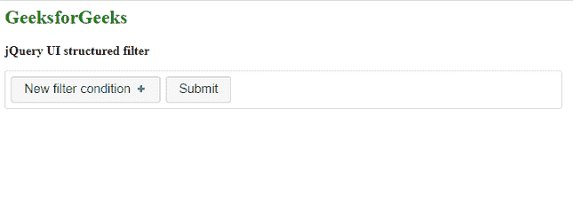
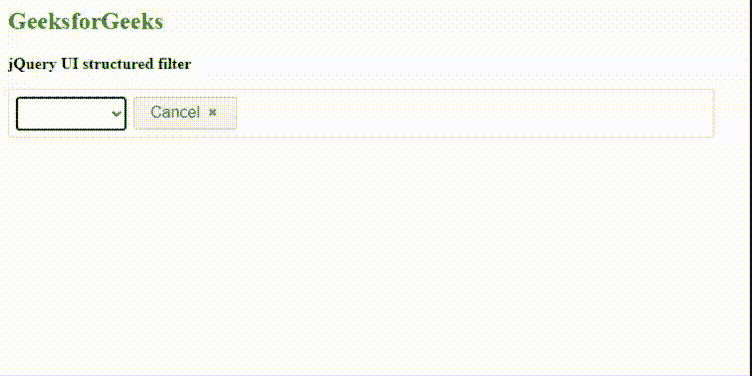
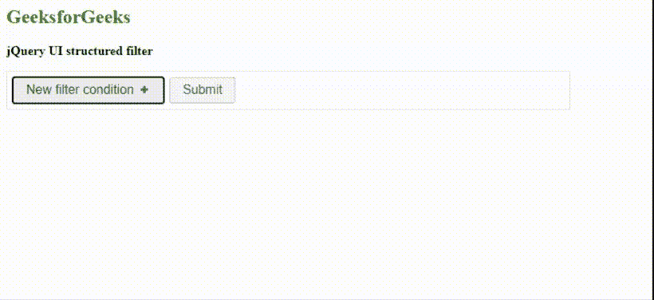

# JavaScript 结构化过滤器插件

> 原文:[https://www . geesforgeks . org/JavaScript-结构化-过滤器-插件/](https://www.geeksforgeeks.org/javascript-structured-filter-plugin/)

在本文中，我们将学习如何使用 JavaScript **结构化过滤器**插件为结构化搜索过滤器查询实现一个通用的基于网络的用户界面。这个插件帮助用户界面提供的小部件创建搜索条件。可以的例子有，某个日期后生日，比率大于 200 等等。

**注意:**请下载工作文件夹中的 JavaScript [**结构化过滤器**](https://github.com/evoluteur/structured-filter) 插件，并将所需文件包含在您的 HTML 代码的头部。

> <link href="”&nbsp;<br/">http://Ajax . Google APIs . com/Ajax/libs/jqueryui/1 . 12 . 1/themes/base/jquery-ui . CSS " rel = " style sheet " type = " text/CSS "/>
> 
> <link href="”structured-filter.css”" rel="”stylesheet”type=”text/css”/">
> 
> <脚本 src= " https://code . jquery . com/ui/1 . 12 . 1/jquery-ui . min . js "></脚本>
> <脚本 src = "结构化-filter . min . js "></脚本>

**示例 1:** 以下示例演示了带有“菜名”、“价格”和“类别”等字段的**结构化过滤器**插件。“类别”字段属于“列表”类型，它是搜索条件中使用的“主菜”、“开胃菜”、“沙漠”等类别的集合。为了更好地理解，请参考下面的输出图像。

## 超文本标记语言

```html
<html>
<head>
  <title>Structured-Filter Plugin</title>

  <!-- Include the stylesheet for jQuery UI -->
  <link rel="stylesheet" type="text/css" media="all"
        href=
"http://ajax.googleapis.com/ajax/libs/jqueryui/1.12.1/themes/base/jquery-ui.css">

  <!-- Include the stylesheet for Structured-Filter -->
  <link rel="stylesheet" type="text/css" media="all"
        href="structured-filter.css" >

  <!-- Include jQuery -->
  <script type="text/javascript"
          src=
"https://ajax.googleapis.com/ajax/libs/jquery/3.5.1/jquery.min.js" >
  </script>

  <!-- Include jQuery UI -->
  <script type="text/javascript"
          src=
"https://code.jquery.com/ui/1.12.1/jquery-ui.min.js" >
  </script>

  <!-- Include the Structured-Filter -->
  <script type="text/javascript" 
          src="structured-filter.min.js" >
  </script>
</head>
<body>
  <h2 style="color:green">GeeksforGeeks</h2>
  <b>jQuery UI structured filter</b>
  <br><br>
  <div id="filterId" style="width:600px">
  </div>
  <script type="text/javascript">
    $(document).ready(function () {

      // Attach the structured-filter
      // to the given element
      $("#filterId").structFilter({
        fields: [
          { id: "name", type: "text", label: "Cuisine name" },
          { id: "price", type: "number", label: "Price" },
          { id: "category", type: "list", label: "Category",
            list: [
              { id: "1", label: "Main course" },
              { id: "2", label: "Starters" },
              { id: "3", label: "Snacks" },
              { id: "4", label: "Dessert" },
              { id: "5", label: "Other" }
            ]
          }
        ]
      });
    });
  </script>
</body>
</html>
```

**输出:**以下输出显示搜索过滤器查询 UI 执行前的屏幕。



以下输出显示了类型为“文本”的“美食名称”字段的过滤器查询用户界面。



以下输出显示了类型为“数字”的“价格”字段的过滤器查询界面。



这演示了查询用户界面功能的执行。



下面显示了上述代码的最终输出。



**示例 2:** 以下示例演示了其他选项设置和事件触发功能。该代码显示了用户单击“提交”按钮时搜索条件查询的网址值。

## 超文本标记语言

```html
<html>
<head>
  <title>Structured-Filter Plugin</title>

  <!-- Include the stylesheet for jQuery UI -->
  <link rel="stylesheet" type="text/css" media="all"
        href=
"http://ajax.googleapis.com/ajax/libs/jqueryui/1.12.1/themes/base/jquery-ui.css">

  <!-- Include the stylesheet for Structured-Filter -->
  <link rel="stylesheet" type="text/css" media="all"
        href="structured-filter.css" >

  <!-- Include jQuery -->
  <script type="text/javascript"
          src=
"https://ajax.googleapis.com/ajax/libs/jquery/3.5.1/jquery.min.js" >
  </script>

  <!-- Include jQuery UI -->
  <script type="text/javascript"
          src=
"https://code.jquery.com/ui/1.12.1/jquery-ui.min.js" >
  </script>

  <!-- Include the Structured-Filter -->
  <script type="text/javascript" 
          src="structured-filter.min.js" >
  </script>
</head>
<body>
  <h2 style="color:green">GeeksforGeeks</h2>
  <b>jQuery UI structured filter</b>
  <br><br>
  <div id="myfilterID" style="width:700px">
  </div>
  <br><br>
  <div id="showUrlId" class="urlClass">
    <script type="text/javascript">
      $(document).ready(function () {

        // Attach the structured-filter
        // to the given element
        $("#myfilterID").structFilter({

          fields: [
            { id: "firstname", type: "text", label: "Firstname" },
            { id: "age", type: "number", label: "Age" },
            { id: "bday", type: "date", label: "Birthday" },
            { id: "category", type: "list", label: "Category",
              list: [
                { id: "1", label: "Family" },
                { id: "2", label: "Friends" },
                { id: "3", label: "Business" },
                { id: "4", label: "Relatives" },
                { id: "5", label: "Other" }
              ]
            }
          ],
          buttonLabels: true,

          // Date is in "mm/dd/yy" format
          dateFormat: "d M,y",
          submitButton: true,
        });
        var output;

        // Event is triggered when the submit
        // button is clicked
        $("#myfilterID").on("submit.search",
                            function (event) {
          output =
            $("#myfilterID").structFilter("valUrl");
          $("#showUrlId").text(output);
        });

        $("#myfilterID").structFilter("clear");
      });
    </script>
  </div>
</body>
</html>
```

**输出:**以下输出显示执行前的画面。



下面显示了最终输出。



以下屏幕显示设置数据选项后的屏幕。

