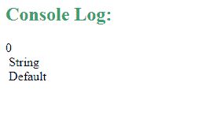

# JavaScript 符号. Symbol.toPrimitive 属性

> 原文:[https://www . geesforgeks . org/JavaScript-symbol-to primitive-property/](https://www.geeksforgeeks.org/javascript-symbol-toprimitive-property/)

在 Javascript 中，通过使用**symbol . topprimitive Property**(用作函数值)，可以将对象转换为其对应的基元值。要调用该函数，需要传递一个名为**提示**的字符串参数。提示参数指定结果基元值的首选返回类型。提示参数可以将“数字”、“字符串”和“默认值”作为它的值。

#### 示例:

## 超文本标记语言

```
<script>
    function myFunction() {

        // Creation of an object with the 
        // Symbol.toPrimitive property 
        const obj2 = {
            [Symbol.toPrimitive](hint) {

                // If hint is number 
                if (hint === 'number') {
                    return 0;
                }

                // If the hint is string
                if (hint == 'string') {
                    return 'String';
                }

                // If hint is default
                if (hint == 'default') {
                    return 'Default';
                }
            }
        };

        // Hint passed is integer
        console.log(+obj2);

        // Hint passed is string
        console.log(`${obj2}`);

        // Hint passed is default
        console.log(obj2 + '');
    }
    myFunction();
</script>
```

#### 输出:



在上面的示例中，根据参数中传递的提示类型，我们获得了所需的输出。