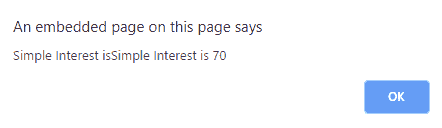

# JavaScript |模板文字

> 原文:[https://www.geeksforgeeks.org/javascript-template-literals/](https://www.geeksforgeeks.org/javascript-template-literals/)

ES6 中的模板文字提供了新的功能来创建一个字符串，从而对动态字符串进行更多的控制。传统上，字符串是使用**单引号(')**或**双引号(")**引号创建的。模板文字使用**倒勾(`)**字符创建。

**语法:**

```
var s=`some string`;
```

**多行字符串:**为了创建多行字符串，使用了转义序列 **\n** 来赋予新的行字符。但是，模板文字没有必要添加 **\n** 字符串只有在得到**倒勾(`)**字符时才会结束。

*   **例:**

    ```
    <script>
    // Without template literal
    console.log('Some text that I want \non two lines!');

    // With template literal
    console.log(`Some text that I want
    on two lines!`);
    </script>
    ```

*   **输出:**

    ```
    Some text that I want
    on two lines!
    Some text that I want
    on two lines!
    ```

**表达式:**为了将值动态添加到新的模板文字中，使用了表达式。${}语法允许其中的表达式产生值。该值可以是存储在变量或计算操作中的字符串。

```
${expression}
```

*   **示例:**下面的代码显示了表达式在模板文字中的使用。

    ```
    <script>
    let principal = 1000;
    let noofyears = 1;
    let rateofinterest = 7;

    let SI = `Simple Interest is ${(principal *
                noofyears * rateofinterest)/100}`;
    alert("Simple Interest is" + SI);
    </script>
    ```

*   **输出:**
    

**标记模板:**模板文字的一个特性是它能够创建标记模板文字。标记文字的编写类似于函数定义，但不同之处在于何时调用该文字。文字调用没有括号()。字符串数组作为参数传递给文字。

*   **例 1:**

    ```
    <script>

    function TaggedLiteralEg(strings) {
        document.write(strings);
    }

    TaggedLiteralEg `GeeksforGeeks`; 

    </script>
    ```

*   **输出:**

    ```
    GeeksforGeeks
    ```

*   **示例 2:** 也可以将值传递给带标签的文字。该值可以是某个表达式的结果，也可以是从变量中获取的值。下面的代码显示了标记文字的用法。

    ```
    <script>
    function TaggedLiteralEg(strings, value, value2) {
        document.write(strings);
        document.write("<br>"+value2+"    "+value);

    }

    let text = 'GeeksforGeeks';
    TaggedLiteralEg`test ${text} ${2+3}`;    
    </script>
    ```

*   **输出:**

    ```
    test , ,
    5 GeeksforGeeks
    ```

**原始字符串:**模板文字的原始方法允许在输入原始字符串时对其进行访问，而无需处理转义序列。此外，String.raw()方法的存在是为了创建原始字符串，就像默认的模板函数一样，字符串串联会创建。

*   **例:**

    ```
    <script>
    var s=String.raw`Welcome to GeeksforGeeks Value of expression is ${2+3}`;
    document.write(s);
    </script>
    ```

*   **输出:**

    ```
    Welcome to GeeksforGeeks Value of expression is 5
    ```

**嵌套模板:**如果模板包含多个表达式求值或多个条件检查，则可以嵌套模板。而不是使用 else 如果梯，这是可读的，让开发人员轻松。下面的代码使用条件运算符和嵌套模板文字查找最多三个数字。

*   **例:**

    ```
    <script>
    function maximum(x, y, z) {
    var c = `value ${ (y>x && y>z) ? 'y is greater' :
    `${x>z ? 'x is greater' : 'z is greater'}` }`;
    return (c);
    }
    document.write(maximum(5, 11, 15)+"<br>");
    document.write(maximum(15, 11, 3)+"<br>");
    document.write(maximum(11, 33, 2)+"<br>");
    </script>                    
    ```

*   **输出:**

    ```
    value z is greater
    value x is greater
    value y is greater
    ```