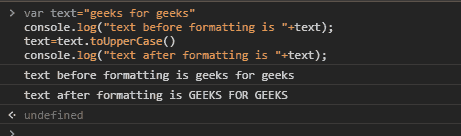
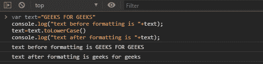
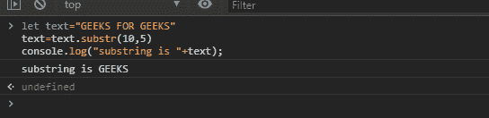
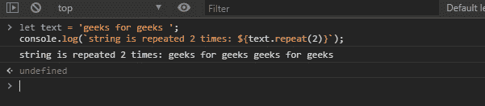
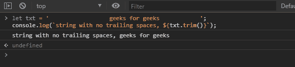

# JavaScript |文本格式

> 原文:[https://www.geeksforgeeks.org/javascript-text-formatting/](https://www.geeksforgeeks.org/javascript-text-formatting/)

JavaScript 有许多内置的特性来格式化文本。文本是 javascript 中的字符串。有许多格式样式，如使文本大写、小写、粗体、斜体。下面给出了每个格式样式的示例。

**使文本大写:**用于将字符串转换为大写。

## java 描述语言

```
let text = "geeks for geeks"
console.log("text before formatting is " + text);
text.toUpperCase()
console.log("text after formatting is " + text);
```

**输出:**


**使文本小写:**用于将字符串转换为小写。

## java 描述语言

```
let text = "GEEKS FOR GEEKS"
console.log("text before formatting is " + text);
text.toLowerCase()
console.log("text after formatting is " + text);
```

**输出:**


**Substr 的用法:**用于从字符串中取子字符串。第一个参数是字符串必须从其开始的索引，第二个参数是子字符串的长度。

**注意:**请注意第二个参数不是指数。

## java 描述语言

```
let text = "GEEKS FOR GEEKS"
text = text.substr(10, 5)
console.log("substring is " + text);
```

**输出:**


**repeat 的用法:**repeat 的用法是当我们需要重复一个特定的字符串或子字符串以特定的次数打印时完成的。

## java 描述语言

```
let text = 'geeks for geeks ';
console.log(`string is repeated 2 times: ${text.repeat(2)}`);
```

**输出:**


**修剪的使用:**用于去除细绳周围多余的空间。

**注意:**它不删除文本和单词之间的空格。

## java 描述语言

```
let txt = '                  geeks for geeks            ';
console.log(`string with no trailing spaces, ${txt.trim()}`);
```

**输出:**
