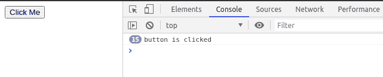
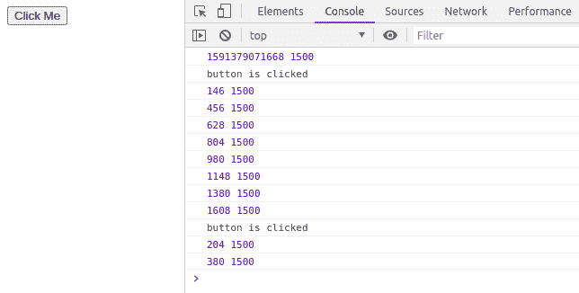

# JavaScript |节流

> 原文:[https://www.geeksforgeeks.org/javascript-throttling/](https://www.geeksforgeeks.org/javascript-throttling/)

节流或者有时也叫节流功能是网站中使用的一种做法。节流用于在每毫秒或特定时间间隔后调用一个函数，只有第一次单击会立即执行。

让我们看看，如果网页中没有节流功能会发生什么。然后按钮被点击的次数，函数将被调用相同的次数。考虑一下这个例子。

**没有节流功能:**在这段代码中，假设按钮被点击 500 次，那么该功能将被点击 500 次，这是由节流功能控制的。

*   **节目:**

## 超文本标记语言

```
<!DOCTYPE html>
<html lang="en">
    <head>
        <meta charset="UTF-8" />
        <meta name="viewport"
              content="width=device-width,
                       initial-scale=1.0" />
        <title>
          JavaScript | Without Throttling
        </title>
    </head>
    <body>
        <button id="nothrottle">Click Me</button>
        <script>

            // Selected button with th egiven id
            const btn = document.querySelector("#nothrottle");

            // Add event listener to the button
            // to listen the click event
            btn.addEventListener("click", () => {
                console.log("button is clicked");
            });
        </script>
    </body>
</html>
```

*   **输出:**



**带节流功能:**在该代码中，如果用户继续点击按钮，除了第一次点击按钮后立即执行的点击之外，每次点击都在 1500 毫秒后执行。

*   **节目:**

## 超文本标记语言

```
<!DOCTYPE html>
<html lang="en">
<head>
  <meta charset="UTF-8">
  <meta name="viewport"
        content="width=device-width, initial-scale=1.0">
  <title>
    JavaScript | With Throttling
  </title>
</head>
<body>
  <button id="throttle">Click Me</button>
  <script>
    const btn=document.querySelector("#throttle");

    // Throttling Function
    const throttleFunction=(func, delay)=>{

      // Previously called time of the function
      let prev = 0;
      return (...args) => {
        // Current called time of the function
        let now = new Date().getTime();

        // Logging the difference between previously
        // called and current called timings
        console.log(now-prev, delay);

        // If difference is greater than delay call
        // the function again.
        if(now - prev> delay){
          prev = now;

          // "..." is the spread operator here
          // returning the function with the
          // array of arguments
          return func(...args); 
        }
      }
    }
    btn.addEventListener("click", throttleFunction(()=>{
      console.log("button is clicked")
    }, 1500));
  </script>
</body>
</html>
```

*   **输出:**



**节流功能优势:**

*   它防止频繁调用函数。
*   它使网站更快，并控制特定功能的调用速度。