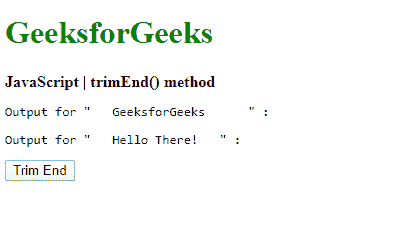
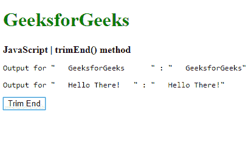
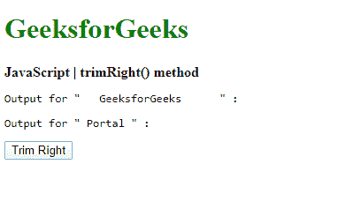
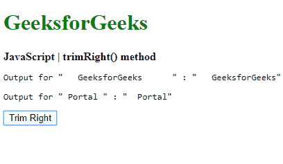

# JavaScript | trimEnd()和 trimRight()方法

> 原文:[https://www . geesforgeks . org/JavaScript-trimend-and-trim right-method/](https://www.geeksforgeeks.org/javascript-trimend-and-trimright-method/)

JavaScript 中的 **trimEnd()** 方法用于删除字符串末尾的空白。字符串的值不会以任何方式修改，包括字符串前面的任何空格。

**语法:**

```
string.trimEnd()
```

**返回值:**返回最后一个字符串，最后去掉所有的空格。

下面的例子说明了这种方法:

**示例:**本示例描述了 trimEnd()方法。

```
<!DOCTYPE html>
<html>

<head>
    <title>
        JavaScript | trimEnd() method
    </title>
</head>

<body>
    <h1 style="color: green">
      GeeksforGeeks
    </h1>
    <b>
      JavaScript | trimEnd() method
    </b>
    <pre>Output for " GeeksforGeeks     " : 
      <span class="output"></span>
    </pre>
    <pre>Output for " Hello There!   " : 
      <span class="output_2"></span>
    </pre>

    <button onclick="trimString()">
        Trim End
    </button>
    <script type="text/javascript">

        /* main function */
        function trimString() {
            str1 =
                " GeeksforGeeks     ";
            str2 =
                " Hello There! ";

            trimmed_out =
                str1.trimEnd();
            trimmed_out2 =
                str2.trimEnd();

            document.querySelector('.output').textContent
                    = '"' + trimmed_out + '"';
            document.querySelector('.output_2').textContent
                    = '"' + trimmed_out2 + '"';
        }
    </script>
</body>

</html>
```

**输出:**

*   **点击按钮前:**
    
*   **点击按钮后:**
    

**trimRight()** 别名， **trimEnd()** 方法有一个别名，即 **trimRight()** 方法。它执行与 trimEnd()完全相同的功能。

**语法:**

```
string.trimRight()
```

**返回值:**返回最后一个字符串，最后去掉所有的空格。

下面的例子说明了这个方法:
**例子:**这个例子描述了 trimRight()方法。

```
<!DOCTYPE html>
<html>

<head>
    <title>
        JavaScript | trimRight() method
    </title>
</head>

<body>
    <h1 style="color: green">
        GeeksforGeeks
    </h1>
    <b>
        JavaScript | trimRight() method
    </b>
    <pre>Output for " GeeksforGeeks     " : 
    <span class="output"></span>
    </pre>
    <pre>Output for " Portal " : 
    <span class="output_2"></span>
    </pre>

    <button onclick="trimString()">
        Trim Right
    </button>
    <script type="text/javascript">

        /* Main function */
        function trimString() {
            str1 =
                " GeeksforGeeks     ";
            str2 =
                " Portal ";

            trimmed_out =
                str1.trimRight();
            trimmed_out2 =
                str2.trimRight();

            document.querySelector('.output').textContent
                    = '"' + trimmed_out + '"';
            document.querySelector('.output_2').textContent
                    = '"' + trimmed_out2 + '"';
        }
    </script>
</body>

</html>
```

**输出:**

*   **点击按钮前:**
    
*   **点击按钮后:**
    

**支持的浏览器:**以下列出了 **trimEnd()** 和 **trimRight()** 方法支持的浏览器:

*   谷歌 Chrome 60
*   Firefox 61
*   边缘 12
*   Safari 12
*   歌剧 53