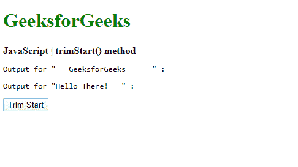
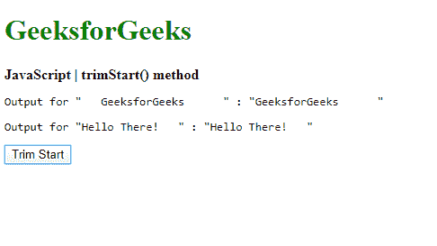
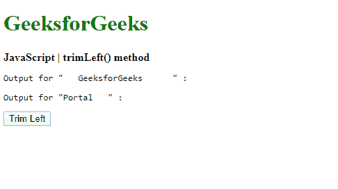
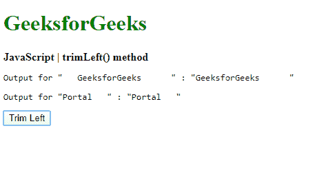

# JavaScript | trimStart()和 trimLeft()方法

> 原文:[https://www . geesforgeks . org/JavaScript-trim start-and-trim left-method/](https://www.geeksforgeeks.org/javascript-trimstart-and-trimleft-method/)

JavaScript 中的 **trimStart()** 方法用于删除字符串开头的空白。字符串的值不会以任何方式修改，包括字符串后面的任何空白。

**语法:**

```
string.trimStart()
```

**返回值:**返回开始时去掉所有空格的最后一个字符串。

**示例:**本示例实现了 trimStart()方法。

```
<!DOCTYPE html>
<html>

<head>
    <title>
        JavaScript trimStart() method
    </title>
</head>

<body>
    <h1 style="color: green">
        GeeksforGeeks
    </h1>

    <b>
        JavaScript | trimStart() method
    </b>

    <pre>Output for " GeeksforGeeks     " : <span
                class="output"></span>
    </pre>

    <pre>Output for "Hello There! " : <span
                class="output_2"></span>
    </pre>

    <button onclick="trimString()">
        Trim Start
    </button>

    <script type="text/javascript">
        function trimString() {
            str1 = " GeeksforGeeks     ";
            str2 = "Hello There! ";

            trimmed_out = str1.trimStart();
            trimmed_out2 = str2.trimStart();

            document.querySelector('.output')
                .textContent = '"' + trimmed_out + '"';

            document.querySelector('.output_2')
                .textContent = '"' + trimmed_out2 + '"';
        }
    </script>
</body>

</html>
```

**输出:**

*   **点击按钮前:**
    
*   **点击按钮后:**
    

**trimLeft()别名:**trim start()方法有一个别名，即 *trimLeft()方法*。它执行与 trimStart()方法完全相同的功能。

**语法:**

```
string.trimLeft()
```

**返回值:**返回开始时去掉所有空格的最后一个字符串。

**示例:**本示例实现了 trimLeft()方法。

```
<!DOCTYPE html>
<html>

<head>
    <title>
        JavaScript | trimLeft() method
    </title>
</head>
<body>
    <h1 style="color: green">
        GeeksforGeeks
    </h1>

    <b>
        JavaScript | trimLeft() method
    </b>

    <pre>Output for " GeeksforGeeks     " : <span
            class="output"></span>
    </pre>

    <pre>Output for "Portal " : <span
            class="output_2"></span>
    </pre>

    <button onclick="trimString()">
        Trim Left
    </button>

    <script type="text/javascript">
        function trimString() {
            str1 = " GeeksforGeeks     ";
            str2 = "Portal ";

            trimmed_out = str1.trimLeft();
            trimmed_out2 = str2.trimLeft();

            document.querySelector('.output')
                .textContent = '"'
                + trimmed_out + '"';
            document.querySelector('.output_2')
                .textContent = '"' 
                + trimmed_out2 + '"';
        }
    </script>
</body>

</html>
```

**输出:**

*   **点击按钮前:**
    
*   **点击按钮后:**
    

**支持的浏览器:**下面列出了 *trimStart()* 方法支持的浏览器:

*   谷歌 Chrome 60
*   Firefox 61
*   边缘 12
*   Safari 12
*   歌剧 53