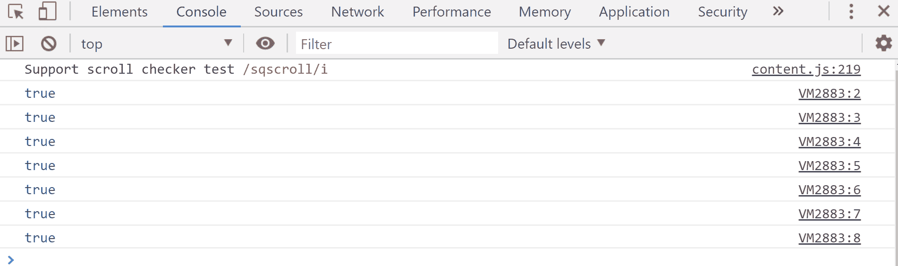
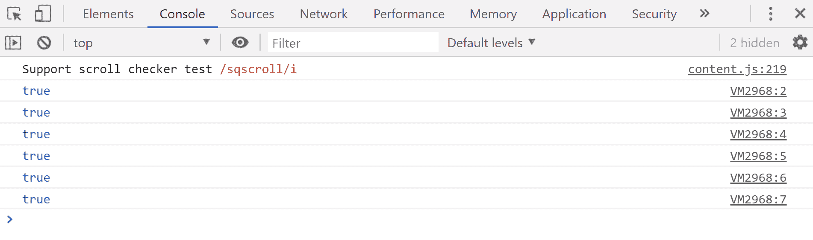
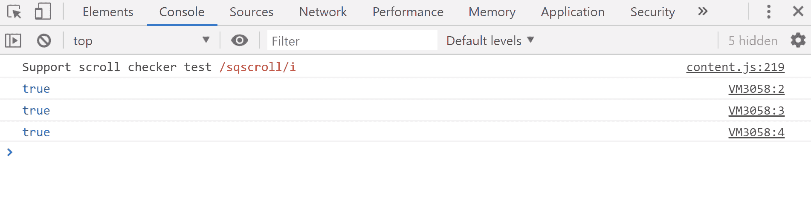
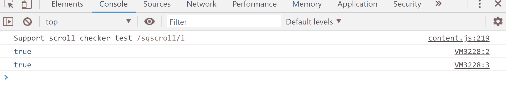
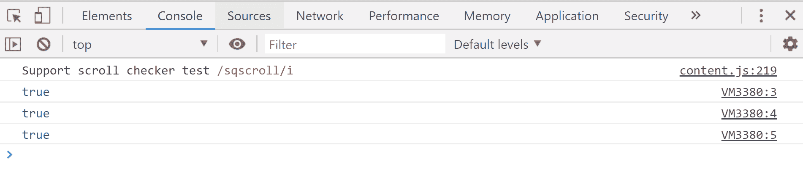

# JavaScript 类型的运算符

> 原文:[https://www.geeksforgeeks.org/javascript-typeof-operator/](https://www.geeksforgeeks.org/javascript-typeof-operator/)

下面是运算符类型的示例。

*   **例:**

    ```
    <script>
    // "string"
    document.write(typeof 'mukul'+"<br>") 

    // "number"
    document.write(typeof 25 +"<br>") 

    // "undefined"
    document.write(typeof variable)
    </script>
    ```

*   **输出:**

    ```
    string
    number
    undefined
    ```

在 JavaScript 中，typeof 运算符以字符串的形式返回其操作数的数据类型。操作数可以是任何对象、函数或变量。

**语法:**

```
typeof operand
```

运筹学

```
typeof (operand)
```

**注意:**操作数是表示要返回类型的对象或基元的表达式。

javascript 中可能存在的类型有:

*   不明确的
*   目标
*   布尔
*   数字
*   线
*   标志
*   功能

**示例:**

```
<script>
// "string"
document.write(typeof 'mukul'+"<br>") 

// "number"
document.write(typeof 25 +"<br>") 

// "undefined"
document.write(typeof variable)
</script>
```

**输出:**

```
string
number
undefined
```

让我们一个接一个地讨论所有类型，为每个代码指定一个代码段。

**示例:** Typeof Number，在这个示例中，我们使用了' === '(严格相等比较运算符)，它比较值和类型，然后返回 true 或 false。例如——考虑第一个 console.log()，js 从左到右开始编译，它首先计算 25 的类型，即“number”，然后将其与“number”进行比较，最后相应地返回 true 或 false。

```
<script> 
  //Number
  console.log(typeof 25 === 'number');
  console.log(typeof 3.14 === 'number');
  console.log(typeof(69) === 'number');   

  // log base 10
  console.log(typeof Math.LN10 === 'number'); 
  console.log(typeof Infinity === 'number'); 

  // Despite being "Not-A-Number"
  console.log(typeof NaN === 'number');

  // Wrapping in Number() function
  console.log(typeof Number('100') === 'number'); 
</script> 
```

**输出:**


**趣事** NaN 代表非数字，有一种“数字”的类型。

**示例:**字符串类型

```
<script> 
  // string
  console.log(typeof '' === 'string');
  console.log(typeof 'bla' === 'string');

  // ES6 template literal
  console.log(typeof `template literal` === 'string');  
  console.log(typeof '1' === 'string');
  console.log(typeof (typeof 1) === 'string');

  // Wrapping inside String() function
  console.log(typeof String(1) === 'string');
</script> 
```

**输出:**


**考试:T1】布尔型**

```
<script> 
  // Boolean
  console.log(typeof true === 'boolean');
  console.log(typeof false === 'boolean');

  // Two calls of the ! (logical NOT) operator 
  // are equivalent to Boolean()
  console.log(typeof !!(1) === 'boolean'); 
</script> 
```

**输出:**


**示例:**类型未定义

```
<script> 
  // Undefined
  console.log(typeof undefined === 'undefined');

  // Declared but undefined variable
  console.log(typeof variable === 'undefined'); 
</script> 
```

**输出:**


**示例:**符号类型

```
<script> 
  // Symbol
  console.log(typeof Symbol() === 'symbol');
  console.log(typeof Symbol('party') === 'symbol');
  console.log(typeof Symbol.iterator === 'symbol');
</script> 
```

**输出:**


**示例:**对象类型

```
<script> 
  // Object
  console.log(typeof {b: 1} === 'object');
  console.log(typeof [1, 2, 9] === 'object');
  console.log(typeof new Date() === 'object');
</script> 
```

**输出:**


**示例:**函数类型

```
<script> 
  // function
  console.log(typeof function() {} === 'function');

  //classes too are objects
  console.log(typeof class C {} === 'function'); 
  console.log(typeof Math.sin === 'function'); sin function(maths)
</script> 
```

**输出:**
