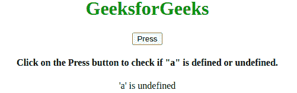

# JavaScript 未定义属性

> 原文:[https://www . geesforgeks . org/JavaScript-undefined-property/](https://www.geeksforgeeks.org/javascript-undefined-property/)

以下是**未定义属性**的示例。

*   **例:**

    ```
    <script>
        var a ="Geeksforgeeks"
        function test() {
            if (typeof a === "undefined") {
                txt = "'a' is undefined";
            } else {
                txt = "'a' is defined";
            }
            document.write(txt);
        }
        test();
    </script>
    ```

*   **输出:**

    ```
    'a' is defined
    ```

**未定义的**属性用于检查一个值是分配给**变量**还是**而不是**。

**语法:**

```
var x;
if (typeof x === "undefined") {
  txt = "x is undefined";
} else {
  txt = "x is defined";
}
```

**返回值:**如果变量被赋予任何值，则返回“已定义”，如果变量没有被赋予任何值，则返回“未定义”。

以上属性的更多示例代码如下:
**程序 1:**

```
<!DOCTYPE html>
<html>

<body>
    <center>
        <h1 style="color: green">
        GeeksforGeeks
    </h1>
        <button onclick="test()">
        Press
    </button>
        <h4>
        Click on the Press button to 
        check if "a" is defined or undefined.
    </h4>
        <p id="gfg"></p>
        <script>
            function test() {
                if (typeof a === "undefined") {
                    txt = "'a' is undefined";
                } else {
                    txt = "'a' is defined";
                }
                document.getElementById(
                "gfg").innerHTML = txt;
            }
        </script>
    </center>
</body>

</html>
```

**输出:**


**支持的浏览器:**

*   谷歌 Chrome
*   火狐浏览器
*   微软公司出品的 web 浏览器
*   歌剧
*   旅行队