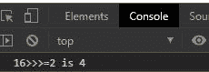
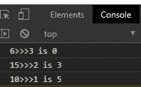

# JavaScript 无符号右移赋值运算符

> 原文:[https://www . geesforgeks . org/JavaScript-无符号-右移-赋值-运算符/](https://www.geeksforgeeks.org/javascript-unsigned-right-shift-assignment-operator/)

在 JavaScript 中“> > > =”被称为无符号右移位赋值按位运算符。此运算符用于向右移动特定数量的位，并返回分配给变量的数字。

**语法:**

```html
a >>>= b

Meaning: a = a >>> b
```

**返回值:**返回移位后的位数。

**例 1:**

## 超文本标记语言

```html
<!DOCTYPE html>
<html lang="en">

<head>
    <meta charset="UTF-8">
    <meta name="viewport" content=
        "width=device-width, initial-scale=1.0">
</head>

<body>
    <script>
        let a = 16
        let b = 2
        console.log(`${a}>>>=${b} is ${a >>>= b}`)
    </script>
</body>

</html>
```

**输出:**



**例 2:** 通过> > >运算符使用变量存储返回值。

## 超文本标记语言

```html
<!DOCTYPE html>
<html lang="en">

<head>
    <meta charset="UTF-8">
    <meta name="viewport" content=
        "width=device-width, initial-scale=1.0">
</head>

<body>
    <script>
        let a = 6
        let b = 3
        c = a >>> b
        console.log(`${a}>>>${b} is ${c}`)
        console.log(`${15}>>>${2} is ${15 >>> 2}`)
        console.log(`${10}>>>${1} is ${10 >>> 1}`)
    </script>
</body>

</html>
```

**输出:**

