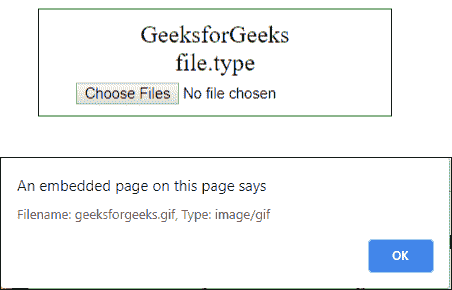

# JavaScript | WebAPI |文件|文件.类型属性

> 原文:[https://www . geesforgeks . org/JavaScript-web API-file-file-type-property/](https://www.geeksforgeeks.org/javascript-webapi-file-file-type-property/)

File.type 属性是 File WebAPI 的一个内置函数，它给出了由文件对象表示的文件的媒体类型(MIME)。

**语法:**

```
var name = file.type;
```

**返回值:**返回一个包含媒体类型(MIME)的字符串，表示文件的类型。例如:“图像/png”为 png 图像。

**示例:**

```
<!DOCTYPE html>
<html>
<head>
    <title>
        WebAPI File.type
    </title>
    <style>
        #test {
            padding: 10px;
            width: 300px;
            border: 1px solid green;
            text-align:center;
            font-size:22px;
        }
    </style>
</head>

<body>
    <div id = "test">
        <div>GeeksforGeeks</div>
        <div>file.type</div>

        <input type = "file" multiple onchange
                = "myGeeks(this)">
    </div>

    <script type = "text/javascript">
        function myGeeks(fileInput) {

        var files = fileInput.files;

            for (var i = 0; i < files.length; i++) {

                var file_name = files[i].name;
                var file_type = files[i].type;

                alert("Filename: " + file_name
                    + ", Type: " + file_type);
            }
        }
    </script>
    </body>
</html>                            
```

**输出:**


**支持的浏览器:**WebAPI file . type 属性支持的浏览器如下:

*   边缘
*   谷歌 Chrome 13.0
*   Firefox 3.6
*   Opera 16.0
*   Internet Explorer 10.0
*   旅行队

**参考:**T2】https://developer.mozilla.org/en-US/docs/Web/API/File/type