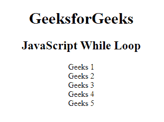
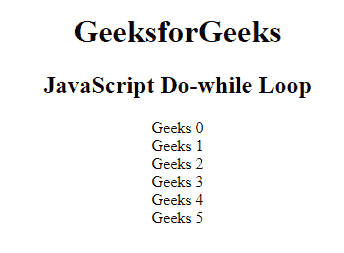
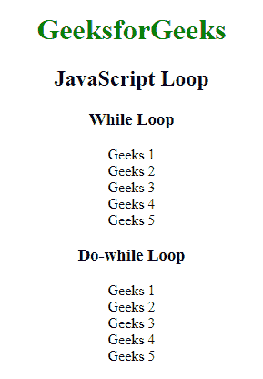

# JavaScript While 循环

> 原文:[https://www.geeksforgeeks.org/javascript-while-loop/](https://www.geeksforgeeks.org/javascript-while-loop/)

Javascript 中的一个 **While 循环**是一个控制流语句，它允许基于给定的布尔条件重复执行代码。while 循环可以看作是一个重复的 if 语句。

[循环](https://www.geeksforgeeks.org/loops-in-javascript/)可以多次执行特定的代码块，直到它与条件不匹配。

主要有两种类型的循环:

*   **进入受控回路**:在这种类型的回路中，测试条件在进入回路体之前进行测试。**为循环**和**而循环**为入口控制循环。
*   **退出受控循环**:在这种类型的循环中，测试条件在循环体的末端进行测试或评估。因此，不管测试条件是真还是假，循环体都将至少执行一次。**边做边循环**是出口控制循环。

**语法:**

```
while (condition) {
    // Statements
}
```

**示例:**这个示例说明了 while 循环的使用。

## 超文本标记语言

```
<!DOCTYPE html>
<html>

<head>
    <title>JavaScript While loop</title>
</head>

<body style="text-align:center;">
    <div>
        <h1>GeeksForGeeks</h1>
        <h2>JavaScript While Loop</h2>
    </div>
    <p id="GFG"></p>

    <!-- Script to use while loop -->
    <script>
    var print = "";
    var val = 1;
    while(val < 6) {
        print += "Geeks " + val;
        print += "<br>"
        val += 1;
    }
    document.getElementById("GFG").innerHTML = print;
    </script>
</body>

</html>
```

**输出:**



while 循环

**Do-While 循环:**Do-While 循环是一种控制流语句，它至少执行一个代码块一次，然后根据代码块末尾的给定布尔条件重复执行该代码块。

**语法:**

```
do {
    // Statements
}
while (condition);
```

**示例:**此示例说明了 do-while 循环的使用。

## 超文本标记语言

```
<!DOCTYPE html>
<html>

<head>
    <title>JavaScript While loop</title>
</head>

<body style="text-align:center;">
    <div>
        <h1>GeeksforGeeks</h1>
        <h2>JavaScript Do-while Loop</h2> </div>
    <p id="GFG"></p>

    <!-- Script to use do-while loop -->
    <script>
    var print = ""
    var val = 0;
    do {
        print += "Geeks " + val;
        print += "<br>";
        val += 1;
    }
    while (val < 6);
    document.getElementById("GFG").innerHTML = print;
    </script>
</body>

</html>
```

**输出:**



边做边循环

**while 和 do-while 循环的比较:**do-while 循环在检查 while 循环的条件之前执行一次循环的内容。While 循环将在执行内容之前首先检查条件。

<figure class="table">

| 

While Loop

 | 

Do-While Loop

 |
| --- | --- |
| 它是一个入口条件循环结构。 | 是退出条件循环结构。 |
| 迭代的次数取决于 while 块中提到的条件。 | 不管 do-while 块中提到的条件如何，至少会有 1 次迭代。 |
| 该块控制条件在循环起点可用。 | 块控制条件在循环端点可用。 |

</figure>

**示例:**此示例说明了 while 和 do-while 循环。

## 超文本标记语言

```
<!DOCTYPE html>
<html>

<head>
    <title>JavaScript loop</title>
</head>

<body style="text-align:center;">
    <div>
        <h1 style="color:green;">
            GeeksforGeeks
        </h1>
        <h2>JavaScript Loop</h2> </div>
    <h3>While Loop</h3>
    <p id="GFG"></p>

    <!-- Script to use while loop -->
    <script>
    var text = "";
    var i = 1;
    while(i < 6) {
        text += "Geeks " + i + "<br>";
        i++;
    }
    document.getElementById("GFG").innerHTML = text;
    </script>
    <h3>Do While Loop</h3>
    <p id="GFG1"></p>

    <!-- Script to use do-while loop -->
    <script>
    var text = ""
    var i = 1;
    do {
        text += "Geeks " + i + "<br>";
        i++;
    }
    while (i < 6);
    document.getElementById("GFG1").innerHTML = text;
    </script>
</body>

</html>
```

**输出:**



Javascript 循环