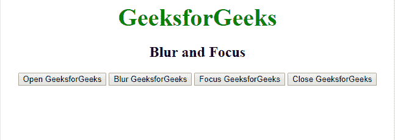
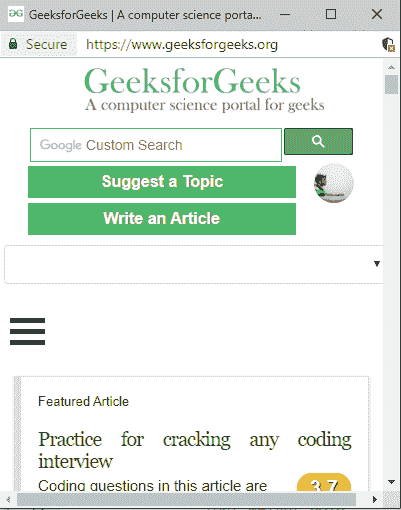

# Javascript |窗口模糊()和窗口聚焦()方法

> 原文:[https://www . geesforgeks . org/JavaScript-window-blur-and-window-focus-method/](https://www.geeksforgeeks.org/javascript-window-blur-and-window-focus-method/)

**Window.blur()方法**
blur()方法用于从当前窗口中移除焦点。也就是说，它将新打开的窗口发送到后台。

**语法:**

```
Window.blur()
```

**参数:**不需要任何参数。

**返回值:**不返回值。

**Window.focus()方法**
focus()方法用于聚焦新打开的窗口。即使模糊窗口回到前景。

**语法:**

```
window.focus()
```

**参数:**不需要任何参数。

**返回值:**不返回值。

下面的例子说明了 JavaScript 中的 window.blur()和 window.focus()方法:

**示例:**

```
<!DOCTYPE html>
<html>

<head>
    <title>
      window Blur and Focus method
    </title>
    <style>
        body {
            text-align: center;
        }

        .gfg {
            font-size: 40px;
            font-weight: bold;
            color: green;
        }
    </style>
</head>

<body>
    <div class="gfg">GeeksforGeeks</div>
    <h2>Blur and Focus</h2>
    <script>
        var Window;

        // Function that open the new Window 
        function windowOpen() {
            Window = window.open(
              "https://www.geeksforgeeks.org/",
                "_blank", "width=400, height=450");
        }

        // function that Closes the open Window 
        function windowClose() {
            Window.close();
        }

        //function that blur the open Window
        function windowBlur() {
            Window.blur();
        }

        //function that focus on open Window
        function windowFocus() {
            Window.focus();
        }
    </script>
    <button onclick="windowOpen()">
      Open GeeksforGeeks
    </button>
    <button onclick="windowBlur()">
      Blur GeeksforGeeks
    </button>
    <button onclick="windowFocus()">
      Focus GeeksforGeeks
    </button>
    <button onclick="windowClose()">
      Close GeeksforGeeks
     </button>
</body>

</html>
```

**输出:**如果点击*模糊极客页面*按钮，则 geeksforgeeks.oge 页面将移至背景，如果点击*聚焦极客页面*按钮，则极客页面窗口将移至前景。

**点击模糊:**


**点击焦点:**


**支持的浏览器:**下面列出了*窗口模糊()和窗口聚焦()方法*支持的浏览器:

*   谷歌 Chrome 1 及以上版本
*   边缘 12 及以上
*   Firefox 1 及以上版本
*   Internet Explorer 4 及以上版本
*   Opera 12.1 及以上
*   Safari 1 及以上