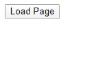
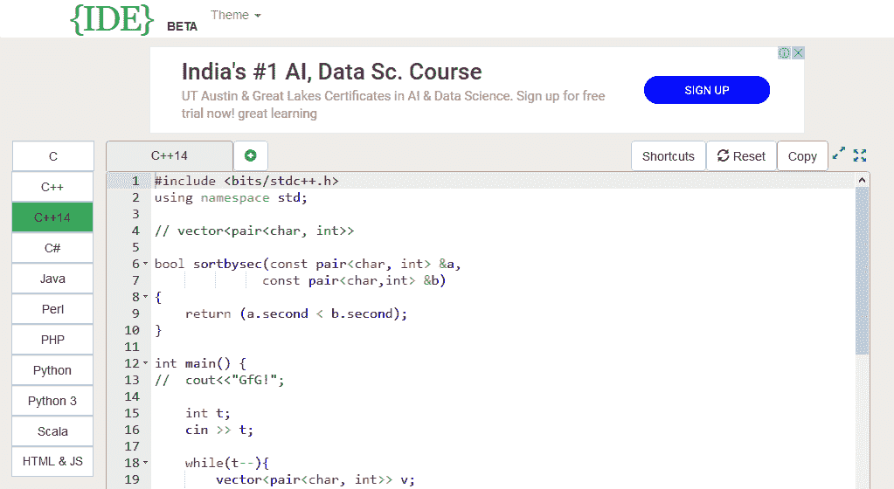

# JavaScript |窗口.位置和文档.位置对象

> 原文:[https://www . geesforgeks . org/JavaScript-window-location-and-document-location-objects/](https://www.geeksforgeeks.org/javascript-window-location-and-document-location-objects/)

**window.location 和 document.location:** 这些对象用于获取 URL(当前或当前的页面地址)，并将浏览器转移到新的页面或窗口。两者的主要区别在于它们与浏览器的兼容性。

*   window.location 在所有兼容的浏览器上都是读/写的。
*   文档位置在互联网浏览器中是只读的，但在基于壁虎的火狐、SeaMonkey 浏览器中是读/写的。

所有现代浏览器都将 document.location 映射到 window.location，但为了跨浏览器安全，您可以选择 window.location。

**语法:**

*   **window.location.href:** 返回当前工作页面的 URL。
*   **window . location . hostname:**返回 web 主机的域名。
*   **window . location . pathname:**返回当前工作页面的路径和文件名。
*   **window . location . protocol:**返回使用的协议(http:或 https:)。
*   **window.location.port():** 打印端口号。
*   **window.location.host():** 打印主机名和端口号。
*   **window . location . assign():**加载新文档。

**示例 1:** 这个示例使用不同的属性来获取 URL 的不同部分。

```
<!DOCTYPE html>
<html lang="en">

<head>
    <title>Get Different Part of a URL</title>
</head>

<body>
    <script>

        // Prints complete URL
        document.write("URL IS:  " 
                + window.location.href + "<br>");

        // Prints hostname like local host (www.example.com)
        document.write("HOSTNAME:  " 
                + window.location.hostname + "<br>");

        // Prints pathname like /products/find.php
        document.write("PATHNAME:  " 
                + window.location.pathname + "<br>");

        // Prints the protocol used like http: or https:
        document.write("PROTOCOL:  " 
                + window.location.protocol + "<br>");

        // Prints hostname with port like localhost:3000
        document.write("HOSTNAME WITH PORT:  " 
                + window.location.host + "<br>");

        // Prints port number like 3000
        document.write("PORTNUMBER:  " 
                + window.location.port + "<br>");
    </script>
</body>

</html>
```

**输出:**

```
URL IS: https://ide.geeksforgeeks.org/tryit.php
HOSTNAME: ide.geeksforgeeks.org
PATHNAME: /tryit.php
PROTOCOL: https:
HOSTNAME WITH PORT: ide.geeksforgeeks.org
PORTNUMBER:
```

**注意:**当你访问一个特定的网站时，它总是连接到一个端口。但是，大多数浏览器不会显示默认端口号。

**示例 2:** 分配或加载新文档。

```
<!DOCTYPE html>
<html lang="en">

<head>
    <title>
        Load another Resource or 
        document from a URL
    </title>

    <script>
        function loadPage() {
            window.location.assign(
                "https://ide.geeksforgeeks.org");
        }
    </script>
</head>

<body>
    <button type="button" onclick="loadPage();">
        Load Page
    </button>
</body>

</html>  
```

**输出:**

*   **点击按钮前:**
    
*   **点击按钮后:**
    