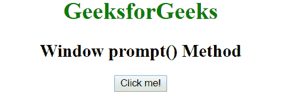
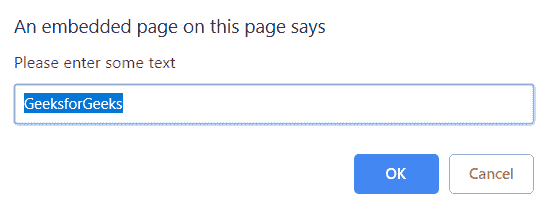
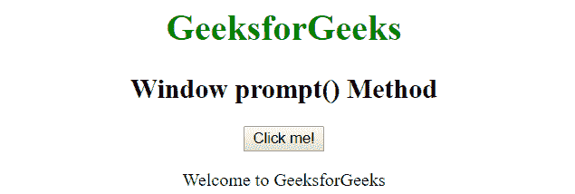

# Javascript |窗口提示()方法

> 原文:[https://www . geesforgeks . org/JavaScript-window-prompt-method/](https://www.geeksforgeeks.org/javascript-window-prompt-method/)

**提示()**方法用于显示一个对话框，其中有一条可选消息提示用户输入一些文本。如果用户想在进入页面之前输入一个值，通常会用到它。
它返回一个包含用户输入的文本的字符串，或者为空。

**语法:**

```
prompt(message, default)

```

*   **消息**是显示给用户的一串文本。如果提示窗口中没有要显示的内容，可以省略，即它是可选的。
*   **默认值**是包含文本输入字段中显示的默认值的字符串。它也是可选的。

**示例:**

```
<!DOCTYPE html>
<html>

<head>
    <title>
        Window prompt() Method
    </title>
</head>

<body style="text-align: center;">
    <h1 style="color:green;">
        GeeksforGeeks
    </h1>
    <h2>
        Window prompt() Method
    </h2>

    <button onclick="geek()">
        Click me!
    </button>
    <p id="g"></p>

    <script>
        function geek() {
            var doc = prompt("Please enter some text",
                "GeeksforGeeks");
            if (doc != null) {
                document.getElementById("g").innerHTML =
                    "Welcome to " + doc;
            }
        }
    </script>
</body>

</html>
```

**输出:**
**点击按钮前:**


**点击后点击我！**
按钮:

**按下对话框中的【确定】按钮后:**


**支持的浏览器:***窗口提示()方法*支持的浏览器如下:

*   谷歌 Chrome
*   微软公司出品的 web 浏览器
*   火狐浏览器
*   歌剧
*   旅行队