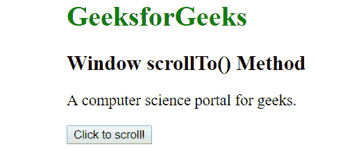

# Javascript |窗口滚动(方法)

> 原文:[https://www . geesforgeks . org/JavaScript-window-scrollto-method/](https://www.geeksforgeeks.org/javascript-window-scrollto-method/)

**窗口滚动()方法**用于滚动到文档中的一组特定坐标。

**语法:**

```
window.scrollTo(x-coord, y-coord)

```

**参数:**scrollTo()方法接受两个参数，如下所述:

*   **x 坐标:**显示在左上角的是沿文档横轴的像素。这是必填字段。
*   **y 坐标:**显示在左上角的是沿文档纵轴的像素。这是必填字段。

**示例:**

```
<!DOCTYPE html>
<html>

<head>
    <title>Window scrollTo() Method</title>
    <style>
        body {
            width: 5000px;
            height: 5000px;
            margin-left: 260px;
        }
    </style>
</head>

<body>
    <h1 style="color:green;">
            GeeksforGeeks
        </h1>
    <h2>
            Window scrollTo() Method
        </h2>

    <p>
        A computer science portal for geeks.
    </p>

    <button onclick="geek()">Click to scroll!</button>

    <script>
        function geek() {
            //Scrolling the document to position "250" 
            //horizontally and "110" vertically
            window.scrollTo(250, 110);
        }
    </script>
</body>

</html>
```

**输出:**
**点击按钮前:**

**点击按钮后:**

**支持的浏览器:**窗口滚动到()方法支持的浏览器如下:

*   谷歌 Chrome
*   微软公司出品的 web 浏览器
*   Firefox 1.0
*   歌剧
*   旅行队