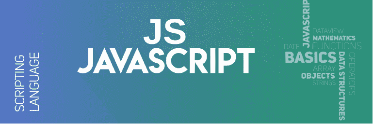
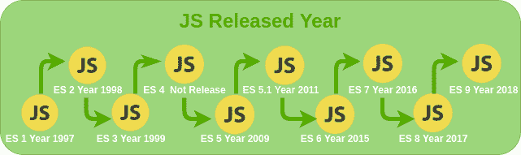

# JS 全表

> 原文:[https://www.geeksforgeeks.org/js-full-form/](https://www.geeksforgeeks.org/js-full-form/)



**JS** 代表 **JavaScript** 。它是一种轻量级的、跨平台的和解释的脚本语言。它以开发网页而闻名，许多非浏览器环境也使用它。JavaScript 可以用于客户端开发和服务器端开发。JavaScript 包含一个标准的对象库，如数组、日期和数学，以及一组核心语言元素，如运算符、控制结构和语句。可以查看[**JavaScript 简介**](https://www.geeksforgeeks.org/introduction-to-javascript/) 。
**JS 版本发布年份:**



**JS 结构:**

## java 描述语言

```
<script type="text/javascript">
    // Your javaScript code
</script>
```

**JS 的特性:**

*   **动态类型语言:**这种语言随着时间的推移可以接收不同的数据类型。
*   **区分大小写格式:** JavaScript 是区分大小写的，所以你要注意这一点。
*   **轻量级:**这么轻量级，所有浏览器都支持 JS。
*   **处理:**处理事件是 JS 的主要特性，当用户试图执行任何操作时，它都可以在网站上轻松响应。
*   **以解释器为中心:** JavaScript 是以解释器为中心构建的，允许用户在不使用编译器的情况下获得输出。

**JS 的优势:**

*   JavaScript 在用户的浏览器上执行，而不是在 web 服务器上，因此它节省了 web 服务器上的带宽和负载。
*   JavaScript 语言很容易学习，它提供了接近英语的语法。
*   在 JavaScript 中，如果你需要任何特定的功能，那么你可以自己编写，并使用像 **Greasemonkey** 这样的插件在网页上实现它。
*   它不需要编译过程，所以不需要编译器，用户的浏览器就可以完成任务。
*   JavaScript 很容易调试，有很多可用的框架，你可以使用并掌握它们。

**JS 的缺点:**

*   JavaScript 代码对用户来说是可见的，因此用户可以在网站中放置一些危及网站数据安全的代码。那将是安全问题。
*   所有浏览器对 JavaScript 的解释都是正确的，但它们对彼此的解释不同。
*   它只支持单一继承，所以在少数情况下可能需要面向对象的语言特性。
*   代码中的一个错误就可以完全停止网站在网站上的代码呈现。
*   JavaScript 将数字存储为 64 位浮点数，但运算符对 32 位按位操作数进行操作。