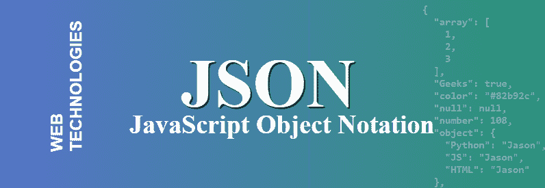

# JSON 简介

> 原文:[https://www.geeksforgeeks.org/json-introduction/](https://www.geeksforgeeks.org/json-introduction/)

**JSON** 代表**J**ava**S**script**O**object**N**旋转。这是一种结构化数据的格式。不同的 web 应用程序使用这种格式相互通信。JSON 是 JSON 中 XML 数据交换格式的替代。与 XML 相比，结构化数据很容易。它支持数组和对象等数据结构，以及在服务器上快速执行的 JSON 文档。它也是一种独立于语言的格式，是从 JavaScript 派生出来的。JSON 的官方媒体类型是应用程序/json，保存这些文件**。json** 分机。



**JSON 的特点:**

*   **通俗易懂:** JSON 易读易写。
*   **格式:**是基于文本的交换格式。它可以将任何类型的数据存储在视频、音频和图像的数组中。
*   **支持:**重量轻，几乎所有语言和 OS 都支持。它对浏览器有广泛的支持，大约每个浏览器都受 JSON 支持。
*   **依存性:**它是一种基于文本的独立语言。与其他基于文本的结构化数据相比，它要快得多。

**JSON 语法规则:**数据以名称/值对的形式存在，它们之间用逗号分隔。它使用花括号来保存对象，使用方括号来保存数组。

**示例:**

## java 描述语言

```
{
    "Courses": [
        {
            "Name" : "Java Foundation",
            "Created by" : "Geeksforgeeks",
            "Content" : [ "Java Core", "JSP",
                        "Servlets", "Collections" ]
        },

        {
            "Name" : "Data Structures",
            "also known as" : "Interview Preparation Course",
            "Topics" : [ "Trees", "Graphs", "Maps" ]
        }
    ]
}
```

**JSON 的优势:**

*   JSON 将所有数据存储在一个数组中，因此数据传输更加容易。这就是为什么 JSON 最适合共享任何大小的数据，甚至是音频、视频等。
*   它的语法非常容易使用。它的语法非常小且轻量级，这就是它以更快的方式执行和响应的原因。
*   JSON 具有广泛的浏览器支持与操作系统的兼容性，不需要太多努力就能使其与所有浏览器兼容。
*   在服务器端解析这是开发人员想要的最重要的部分，如果解析在服务器端很快，那么用户可以得到快速的响应，所以在这种情况下，JSON 服务器端解析是与其他解析相比的强项。

**JSON 的缺点:**

*   JSON 的主要缺点是 JSON 中没有错误处理，如果 JSON 脚本中有一个小错误，那么您将无法获得结构化数据。
*   当你在一些未经授权的浏览器上使用 JSON 时，它变得相当危险。就像 JSON 服务返回一个用函数调用包装的 JSON 文件，浏览器必须执行这个函数调用。如果浏览器未经授权，那么你的数据就会被黑客攻击。
*   JSON 有有限的支持工具，我们可以在 JSON 开发过程中使用。