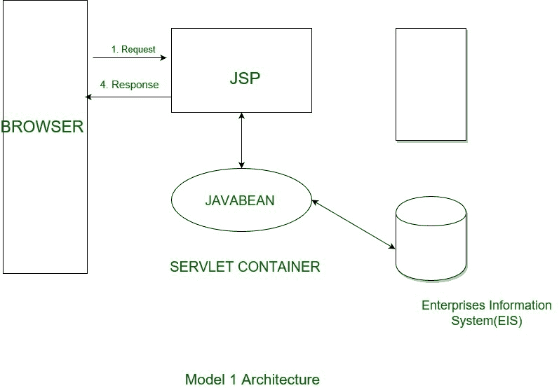
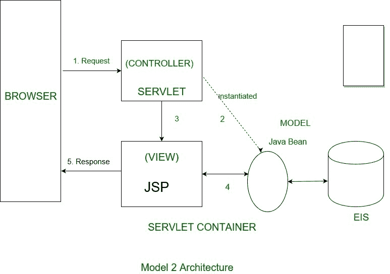

# JSP 访问模型

> 原文:[https://www.geeksforgeeks.org/jsp-access-model/](https://www.geeksforgeeks.org/jsp-access-model/)

JSP 是基于 java 的技术，用于简化动态网页的开发。JSP 用于借助 HTML 和 JSP 标签将网页的动态内容与其内容分离。

**有两个 JSP 模型架构:**

*   **JSP Model 1 Architecture:**
    JSP Model1 Architecture or JSP Centric architecture contains JavaBeans or EJB Model Object, View JSP pages and Action JSP Pages.
    In model 1 architecture, the incoming request is directly sent to the JSP page from a web browser and JSP page is responsible for processing it and sending back to the client. All the data access is performed using beans so there is still a separation of presentation from content.

    **JSP 中心模型的优势:**

    1.  构建应用程序需要少量组件。
    2.  少量技术，减少无经验资源的学习曲线。

    **JSP 中心模型的缺点:**

    1.  架构产生了一个具有硬编码页面名称的紧密耦合的应用程序。
    2.  Access JSP 页面主要是 java 代码，但是不能像 java 代码那样容易开发、编译和调试。
    3.  处理和验证的重用由于其在表单特定动作 JSP 页面中的位置而受到阻碍。

    

*   **JSP 模型 2 架构:**
    JSP 模型 2 架构或以 servlet 为中心的架构包含 Java beans 或 EJB 模型对象，查看 JSP 页面和 Servlet 或命令类。
    它基本上是一种模型视图控制器方法，涉及通知/事件模型，直接操纵模型对象。MVC 基本上在视图和模型组件之间插入控制器组件，其中控制器负责导航、表示层逻辑和验证，并强调表示层逻辑和模型对象的分离。
    

**MVC 的特点:**

1.  客户端不会直接请求页面。所有的客户端请求都被送到控制器 servlet。
2.  每个请求都包括数据，即:请求操作，该操作的任何参数。
3.  控制器 servlet 决定哪个页面应该返回给用户，用要显示给用户的数据扩充请求对象。

**MVC 的优势:**

*   MVC 方法通过在 JSP 页面中不提供导航代码和完整的数据操作来简化 JSP 页面。
*   呈现和处理逻辑的清晰分离。
*   前端组件提供了进入应用程序的单一入口点，从而使应用程序状态、安全性和表示的管理变得统一和易于维护。
*   使用同一模型的多个视图。

处理过程分为表示(JSp)和控制器(前端组件)。呈现组件是生成决定浏览器呈现的用户界面的 HTML/XML 响应的 JSP 页面。前端组件不处理任何表示问题，而是处理所有的 HTTP 请求。他们负责创建表示组件使用的 beans 或对象，并根据用户的操作决定将请求转发到哪个表示组件。前端组件可以实现为 servlet 或 JSP。
**控制员职责:**

1.  请求处理
2.  创建演示 JSP 使用的任何 beans 或对象。
3.  根据用户的操作，决定将请求转发到哪个 JSP。
4.  Data validation

    **视图职责:**
    演示 JSP 本身没有处理逻辑:它只是负责检索 servlet 先前可能创建的对象，并提取动态内容，以便与静态模板一起插入。