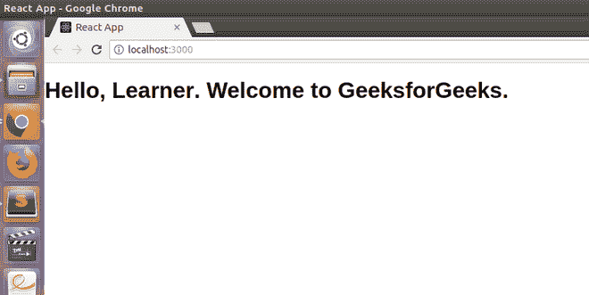

# JSX 全形

> 原文:[https://www.geeksforgeeks.org/jsx-full-form/](https://www.geeksforgeeks.org/jsx-full-form/)

[JSX](https://www.geeksforgeeks.org/reactjs-introduction-jsx/) 代表 JavaScript XML。它只是 JavaScript 的语法扩展。它允许我们直接用 React(在 JavaScript 代码中)编写 HTML。在 React 中使用 JSX 创建一个模板很容易，但它不是一种简单的模板语言，相反，它具有 JavaScript 的全部功能。
它比普通的 JavaScript 更快，因为它在翻译成普通 JavaScript 时会执行优化。React 没有在分离的文件中分离标记和逻辑，而是为此使用了*组件*。我们将在后续文章中详细了解组件。

**语法:**

```
const element = <h1>Welcome to GeeksforGeeks.</h1>;
```

**JSX 特色:**

*   JSX 并没有强制使用，还有其他方法可以实现同样的事情，但是使用 JSX 可以更容易地开发 react 应用程序。
*   JSX 允许用{ }书写表达。表达式可以是任何 JS 表达式或 React 变量。
*   要插入一大块 HTML，我们必须把它写在括号里，也就是()。
*   JSX 产生反作用元素。
*   JSX 遵循 XML 规则。
*   编译后，JSX 表达式成为常规的 JavaScript 函数调用。
*   JSX 使用卡米凯斯符号来命名 HTML 属性。例如，HTML 中的 tabindex 在 JSX 被用作 tabIndex。

**JSX 优势:**

*   JSX 使得在 React 中编写或添加 HTML 变得更加容易。
*   JSX 可以轻松地将 HTML 标签转换为反应元素。
*   它比普通的 JavaScript 快。
*   JSX 允许我们在不使用 [appendChild()](https://www.geeksforgeeks.org/html-dom-appendchild-method/) 或 [createElement()](https://www.geeksforgeeks.org/html-dom-createelement-method/) 方法的情况下将 HTML 元素放入 DOM。
*   由于 JSX 是一个表达式，我们可以在 if 语句和循环中使用它，将其赋给变量，将其作为参数接受，或者从函数中返回。
*   JSX 阻止了 XSS(跨站点脚本)攻击，这种攻击通常被称为注入攻击。
*   它是类型安全的，大多数错误都可以在编译时找到。

**JSX 的劣势:**

*   如果 HTML 不正确，JSX 会抛出一个错误。
*   在 JSX，HTML 代码必须包装在一个顶级元素中，否则会出错。
*   如果 HTML 元素没有正确关闭，JSX 会给出一个错误。

**示例:**

## index.js

```
import React from 'react';
import ReactDOM from 'react-dom';

const name = "Learner";

const element = <h1>Hello,
{ name }.Welcome to GeeksforGeeks.< /h1>;

ReactDOM.render(
    element,
    document.getElementById("root")
);
```

**输出:**

