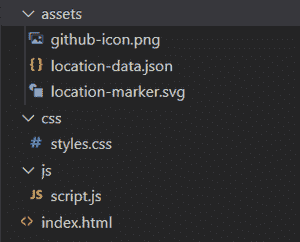

# 小页面–使用 JavaScript 与地图交互

> 原文:[https://www . geesforgeks . org/leablejs-与地图交互-使用-javascript/](https://www.geeksforgeeks.org/leafletjs-interacting-with-maps-using-javascript/)

地图已经成为我们日常生活中不可或缺的一部分。从开车到一个地方，到在附近找到一些餐馆或商店，或者在计划旅行时，几乎每种类型的应用都使用地图。使用地图有助于我们在应用程序中添加基于位置的服务。

在 web 应用程序中添加地图的一种方法是使用活页 JS。传单 JS 是一个开源的 JavaScript 库，用于添加简单和交互式的网络地图。它可以将地图数据添加到地图图层中，并具有大多数应用程序所需的平移、缩放等功能。虽然传单提供了任何地图应用程序所需的一些核心功能，但增加地图功能的一个简单方法是使用第三方插件。因为传单是一个开源库，也就是说，它的源代码可以在 GitHub 上获得，所以有很多贡献，也有很多可用的插件。你可以在这里获得插件列表[。](https://leafletjs.com/plugins.html)

因此，传单是一个地图应用编程接口，它帮助我们与地图数据交互，但它不提供任何数据。它也不提供地图本身，因为它不是地图服务。那么我们如何得到地图呢？答案是，小叶依赖于第三方提供底图，即小叶的构建方式可用于多个基础地图图层。一般来说，传单与开放街道地图一起使用，但我们甚至可以使用其他地图提供商，如地图盒，四儿，必应地图图层等。您可以在这里查看不同的底图提供者[。](https://leafletjs.com/plugins.html#basemap-providers)

因此，让我们一步一步了解如何使用传单与地图互动:

**1。目录结构**



这是本例中将遵循的目录结构。您也可以有不同的目录结构，但是要确保它也反映在您的代码中。

**2。HTML 样板和添加传单参考**

## 超文本标记语言

```
<!DOCTYPE html>
<html>

<head>
    <title> Playing Around With Leaflet JS </title>
    <meta charset="UTF-8">
    <meta name="viewport" content=
        "width=device-width, initial-scale=1.0">

    <!-- Leaflet CSS -->
    <link rel="stylesheet" href=
"https://unpkg.com/leaflet@1.7.1/dist/leaflet.css"
        integrity=
"sha512-xodZBNTC5n17Xt2atTPuE1HxjVMSvLVW9ocqUKLsCC5CXdbqCmblAshOMAS6/keqq/sMZMZ19scR4PsZChSR7A=="
        crossorigin="" />

    <!-- Leaflet JS -->
    <script src="https://unpkg.com/leaflet@1.7.1/dist/leaflet.js"
        integrity=
"sha512-XQoYMqMTK8LvdxXYG3nZ448hOEQiglfqkJs1NOQV44cWnUrBc8PkAOcXy20w0vlaXaVUearIOBhiXZ5V3ynxwA=="
        crossorigin=""></script>
</head>

<body></body>

</html>
```

为了给我们的网页添加地图，需要像 HTML、CSS 和 JavaScript 这样简单的网络技术。要在代码中使用传单，您需要添加传单 CSS 和传单 JS。您可以[下载](https://leafletjs.com/download.html)它们，或者通过包含它们的 cdn 来使用它们(参见上面的代码示例)。

**3。创建一个地图容器并创建一个地图对象**

```
<div id="mymap"> </div>
```

我们首先定义一个容器元素，我们希望在其中加载地图，并为它提供一个 id“my map”。

```
let map = L.map('mymap').setView([19.5937, 78.9629], 5);
```

现在，我们创建一个地图对象，我们将使用它来创建和操作地图。我们用上面创建的容器元素的 id 来实例化 map 对象，即“mymap”。setview 方法用于设置地图的中心和缩放级别。

**4。使用 TileLayer 添加地图切片**

## java 描述语言

```
L.tileLayer('https://{s}.tile.openstreetmap.org/{z}/{x}/{y}.png', {
    attribution: '© OpenStreetMap contributors',
    maxZoom: 20,
    minZoom: 2,
    tileSize: 512,
    zoomOffset: -1
}).addTo(map);
```

为了加载和显示我们的地图，我们使用 TileLayer 类来创建一个图层并指定地图切片的 URL。地图被分成多个小块，我们使用 OpenStreetMap 来显示地图小块。您可以在这里获得瓷砖供应商的列表。我们确实指定了一些附加参数，如最小缩放级别、最大缩放级别、图块大小。当我们使用开放街道地图的地图切片时，我们需要为开放街道地图(或您正在使用的任何地图切片提供商)提供使用其地图切片的适当属性(或信用)。为了在地图上添加这个图层，我们使用了 addTo()方法。

**5。制作包含标记的数据集**

> https://github.com/OptimalLearner/Leaflet-JS-Example-Code/blob/master/assets/location-data.json

现在，我们需要在地图上添加一些指向某个位置的标记。我们已经将数据保存在一个名为“location-data.json”的不同文件中。该文件包含标记细节，如纬度和经度坐标等。您可以从上面提供的链接访问数据，并将其与代码一起保存。如果您想将数据保存在您的 JS 文件本身中，您可以创建一个变量并将其分配给上面的数据。

**6。创建标记、绑定弹出窗口和事件处理**

## java 描述语言

```
let marker = L.marker([latitude, longitude]).bindPopup(`<h3> ${title} </h3> 
<p> ${description} </p>
`).on('click', () => {
    map.flyTo([latitude, longitude], zoomLevel);
}).addTo(map);
```