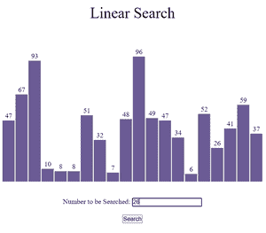
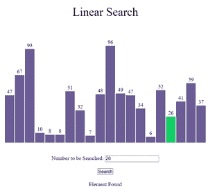
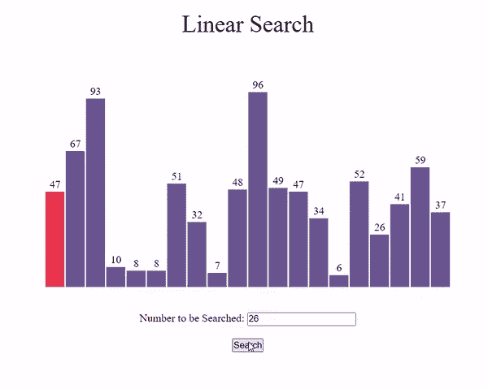

# 使用 JavaScript 的线性搜索可视化

> 原文:[https://www . geesforgeks . org/linear-search-visualization-use-JavaScript/](https://www.geeksforgeeks.org/linear-search-visualization-using-javascript/)

**图形用户界面**比程序更容易理解。在本文中，我们将使用 JavaScript 可视化线性搜索。我们将看到如何在线性搜索中遍历元素，直到找到给定的元素。我们还将可视化线性搜索的时间复杂性。

**参考:**

*   [线性搜索](https://www.geeksforgeeks.org/linear-search/)
*   [JavaScript 中的异步函数](https://www.geeksforgeeks.org/how-to-create-an-asynchronous-function-in-javascript/)

**进场:**

*   首先，我们将使用 [Math.random()](https://www.geeksforgeeks.org/javascript-math-random-method/) 函数生成一个随机数组。
*   不同的颜色用于指示当前时间哪个元素正在被**遍历**。
*   由于算法的运算速度非常快， [setTimeout()](https://www.geeksforgeeks.org/java-script-settimeout-setinterval-method/) 功能被用来减缓进程。
*   按**“Ctrl+R”**键可生成新数组。
*   使用 LinearSearch()函数执行搜索。

**示例:**



搜索前



搜索后

下面是可视化线性搜索算法的程序。

## index.html

```
<!DOCTYPE html>
<html lang="en">
  <head>
    <meta charset="UTF-8" />
    <meta name="viewport" 
          content="width=device-width, initial-scale=1.0" />
    <link rel="stylesheet" href="style.css" />
  </head>

  <body>
    <br />
    <p class="header">Linear Search</p>

    <div id="array"></div>
    <br /><br />

    <div style="text-align: center">
      <label for="fname">
        Number to be Searched:
      </label>
      <input type="text" id="fname" name="fname" />
      <br /><br />
      <button id="btn"
              onclick="LinearSearch()">Search
      </button>
      <br />
      <br />
      <div id="text"></div>
    </div>

    <script src="script.js"></script>
  </body>
</html>
```

## style.css

```
* {
  margin: 0px;
  padding: 0px;
  box-sizing: border-box;
}

.header {
  font-size: 35px;
  text-align: center;
}

#array {
  background-color: white;
  height: 305px;
  width: 598px;
  margin: auto;
  position: relative;
  margin-top: 64px;
}

.block {
  width: 28px;
  background-color: #6b5b95;
  position: absolute;
  bottom: 0px;
  transition: 0.2s all ease;
}

.block_id {
  position: absolute;
  color: black;
  margin-top: -20px;
  width: 100%;
  text-align: center;
}
```

## script.js

```
var container = document.getElementById("array");

// Function to generate the array of blocks
function generatearray() {
  for (var i = 0; i < 20; i++) {
    // Return a value from 1 to 100 (both inclusive)
    var value = Math.ceil(Math.random() * 100);

    // Creating element div
    var array_ele = document.createElement("div");

    // Adding class 'block' to div
    array_ele.classList.add("block");

    // Adding style to div
    array_ele.style.height = `${value * 3}px`;
    array_ele.style.transform = `translate(${i * 30}px)`;

    // Creating label element for displaying
    // size of particular block
    var array_ele_label = document.createElement("label");
    array_ele_label.classList.add("block_id");
    array_ele_label.innerText = value;

    // Appending created elements to index.html
    array_ele.appendChild(array_ele_label);
    container.appendChild(array_ele);
  }
}

// Asynchronous LinearSearch function
async function LinearSearch(delay = 300) {
  var blocks = document.querySelectorAll(".block");
  var output = document.getElementById("text");

  //Extracting the value entered by the user
  var num = document.getElementById("fname").value;

  //Changing the color of all the blocks to voilet
  for (var i = 0; i < blocks.length; i += 1) {
    blocks[i].style.backgroundColor = "#6b5b95";
  }

  output.innerText = "";

  var flag = 0;
  // LinearSearch Algorithm
  for (var i = 0; i < blocks.length; i += 1) {
    //Changing the color of current block to red
    blocks[i].style.backgroundColor = "#FF4949";

    // To wait for .1 sec
    await new Promise((resolve) =>
      setTimeout(() => {
        resolve();
      }, delay)
    );

    //Extracting the value of current block
    var value = Number(blocks[i].childNodes[0].innerHTML);

    // To compare block value with entered value
    if (value == num) {
      flag = 1;
      output.innerText = "Element Found";
      blocks[i].style.backgroundColor = "#13CE66";
      break;
    } else {
      // Changing the color to the previous one
      blocks[i].style.backgroundColor = "#6b5b95";
    }
  }
  //When element is not found in the array
  if (flag == 0) {
    output.innerText = "Element Not Found";
  }
}

// Calling generatearray function
generatearray();
```

**输出:**

