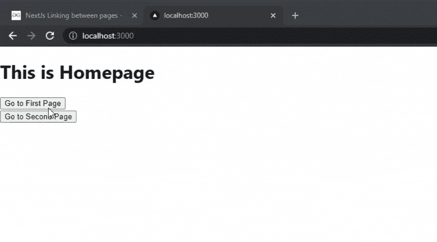

# next . js 中页面之间的链接

> 原文:[https://www . geeksforgeeks . org/下一页链接 js/](https://www.geeksforgeeks.org/linking-between-pages-in-next-js/)

在本文中，我们将看到如何在 Next.js 中将一个页面链接到另一个页面。

要创建新的 NextJs 应用程序，请在您的终端中运行以下命令:

```
npx create-next-app GFG
```

创建项目文件夹(即 GFG)后，使用以下命令移动到该文件夹:

```
cd GFG
```

**项目结构:**会是这样的。


**创建页面:**首先，我们将在 Next.js 项目中创建两个不同的页面。为此，在 pages 文件夹内创建两个名为“first”和“second”的新 JavaScript 文件。

**文件名:first.js**

## java 描述语言

```
import React from 'react'

export default function first() {
    return (
        <div>
            This is the first page.
        </div>
    )
}
```

**文件名:second.js**

## java 描述语言

```
import React from 'react'

export default function second() {
    return (
        <div>
            This is the second page.
        </div>
    )
}
```

**链接页面:**现在要链接页面，我们将使用“next/link”中的“link”组件。我们可以在链接组件中添加<标签。我们可以在脚本中添加下面一行来导入这个组件。

```
import Link from 'next/link'
```

为了将“第一”和“第二”页面与主页链接起来，我们将在 pages 文件夹的 index.js 文件中添加下面的行。

**文件名:index.js**

## java 描述语言

```
// Importing the Link component
import Link from 'next/link'

export default function Home() {
    return (
        <div>
            {/* Adding Heading */}
            <h1>
                This is Homepage
            </h1>

            {/* Adding the Link Component */}
            <Link href="/first">
                <a><button>Go to First Page</button></a>
            </Link>
            <br />
            <Link href="/second">
                <a><button>Go to Second Page</button></a>
            </Link>
        </div>
    )
}
```

**文件名:first.js** 现在我们也要在‘第一’和‘第二’页面中添加‘链接’组件。

## java 描述语言

```
// Importing the Link component
import Link from 'next/link'

export default function first() {
    return (
        <div>
            This is the first page.
            <br />
            {/* Adding the Link Component */}
            <Link href="/first">
                <a><button>Go to First Page</button></a>
            </Link>
            <br />
            <Link href="/second">
                <a><button>Go to Second Page</button></a>
            </Link>
        </div>
    )
}
```

**文件名:second.js**

## java 描述语言

```
// Importing the Link component
import Link from 'next/link'

export default function second() {
    return (
        <div>
            This is the second page.
            <br />
            {/* Adding the Link Component */}
            <Link href="/first">
                <a><button>Go to First Page</button></a>
            </Link>
            <br />
            <Link href="/second">
                <a><button>Go to Second Page</button></a>
            </Link>
        </div>
    )
}
```

**运行应用程序的步骤:**现在使用以下命令运行应用程序:

```
npm start
```

**输出:**

