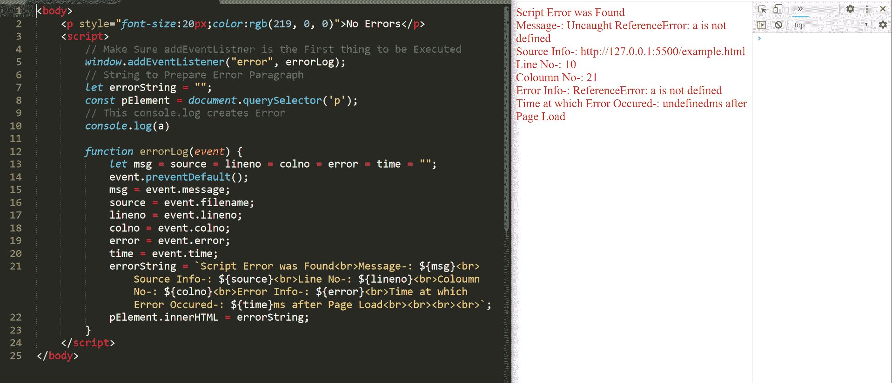
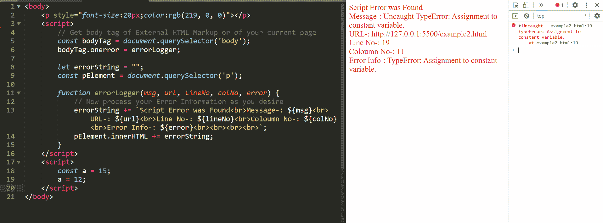
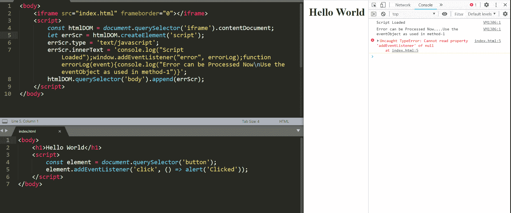

# 记录 JavaScript 中的脚本错误

> 原文:[https://www . geesforgeks . org/logging-script-errors-in-JavaScript/](https://www.geeksforgeeks.org/logging-script-errors-in-javascript/)

在本文中，我们将学习使用 JavaScript 记录脚本错误。如果来自任何其他来源的脚本在网站下运行/执行(例如，在 iframe 中)，或者如果您的任何查看者利用浏览器的控制台试图更改脚本，或者您想要监控您的 JS 代码在投入生产时可能遇到的错误，这将非常有用。

**方法:**我们将学习 3 种方法来完成这项任务——所有方法都遵循相同的方法，但实现方法和提取有用信息的方式不同。用最适合你的东西。

1.  **window.addEventListener(“错误”，**//yourrorlogerfunction**)**—将错误事件附加到窗口对象(DOM)。
2.  **document . queryselector(' body ')。one rror =**//yourrorlogerfunction—正文标记中的错误侦听器- >在相同来源或相同来源的跨脚本中工作。
3.  **创建一个脚本元素**并将其附加到源的主体标签中。

所有这三种方法都可以在同一个源或任何外部源中实现。

**注意** —确保这是浏览器要执行的第一件事(如果不确定，强烈建议使用方法 2)。

**方法 1:** 在这个方法中，我们将向窗口对象附加一个事件监听器。每当出现任何脚本错误时，都会触发附加的错误日志记录函数，在错误日志记录函数中，我们将从错误日志记录函数接收的事件对象中提取所有有用的信息。

## java 描述语言

```html
window.addEventListener("error", errorLog);

function errorLog(event) {

    // Declare all variables as null
    // necessary in case of multiple
    // errors to be logged
    let msg = source = lineno = colno
                    = error = time = "";

    // Use prevent default in case you
    // don't want the error to be logged
    // in the console / hide the error
    event.preventDefault();
    msg = event.message;
    source = event.filename;
    lineno = event.lineno;
    colno = event.colno;
    error = event.error;
    time = event.time;
    // This time is in ms and tells us
    // time after which the error occured
    // after the page was loaded
    // a lot other information can be
    // gathered - explore the event object
    // After extracting all the information
    // from this object now log it on your
    // server Database
}
```

**找到 HTML 代码(方法 1):**

## 超文本标记语言

```html
<!DOCTYPE html>
<html lang="en">

<head>
    <meta charset="UTF-8">
    <meta name="viewport" content=
        "width=device-width, initial-scale=1.0">
    <title>Document</title>
</head>

<body>
    <p style="font-size:20px;color:rgb(219, 0, 0)">
        No Errors
    </p>

    <script>
        // Make Sure addEventListener is the
        // First thing to be Executed
        window.addEventListener("error", errorLog);

        // String to Prepare Error Paragraph
        let errorString = "";
        const pElement = document.querySelector('p');

        // This console.log creates Error
        console.log(a)

        function errorLog(event) {
            let msg = source = lineno
                = colno = error = time = "";
            event.preventDefault();
            msg = event.message;
            source = event.filename;
            lineno = event.lineno;
            colno = event.colno;
            error = event.error;
            time = event.time;

            errorString = `Script Error was Found<br>
            Message-: ${msg}<br>Source Info-: ${source}
            <br>Line No-: ${lineno}<br>Column No-:
            ${colno}<br>Error Info-: ${error}<br>Time
            at which Error Occured-: ${time}ms after
            Page Load<br><br><br><br>`;

            pElement.innerHTML = errorString;
        }
    </script>
</body>

</html>
```



示例-方法 1

**方法 2:** 在这个方法中，我们将使用一个错误事件处理程序。

*   **步骤 1 —** 获取该 HTML 标记的主体标记，无论是外部 HTML 标记还是当前加载页面的标记。
*   **步骤 2 —** 现在，当我们在一个常量标识符中获得主体标签时，假设常量主体标签，我们将向主体标签添加一个错误事件处理程序。

## java 描述语言

```html
const bodyTag =

    // body tag of External HTML
    // Markup or of your page
    bodyTag.onerror = errorLogger;

function errorLogger(msg, url,
    lineNo, columnNo, error) {

    // Now process your Error
    // Information as you desire
}
```

你注意到上面两种方法的记录器函数的不同了吗——通常在触发任何事件的情况下，附加到它的函数接收一个事件对象，但是在这种情况下(方法 2)，我们接收一个预先提取的信息(详细原因请参考 MDN 网络文档)。

**注意—** 记住记录器功能中接收到的错误信息的顺序—总共 5 条信息—顺序始终相同。

**找到 HTML 代码(方法 2):**

## 超文本标记语言

```html
<!DOCTYPE html>
<html lang="en">

<head>
    <meta charset="UTF-8">
    <meta name="viewport" content=
        "width=device-width, initial-scale=1.0">
</head>

<body onerror="errorLogger(message,
    source, lineno, colno, error)">

    <p style="font-size:20px;
        color:rgb(219, 0, 0)">
    </p>

    <script>

        // You can directly set the onerror
        // Attribute or use below 2 lines
        // Get body tag of External HTML
        // Markup or of your current page
        const bodyTag = document.querySelector('body');
        // bodyTag.onerror = errorLogger;

        let errorString = "";
        const pElement = document.querySelector('p');

        function errorLogger(msg, url,
                lineNo, colNo, error) {

            // Now process your Error Information
            // as you desire
            errorString += `Script Error was Found
            <br>Message-: ${msg}<br>URL-: ${url}
            <br>Line No-: ${lineNo}<br>Column No-:
            ${colNo}<br>Error Info-: ${error}<br>
            <br><br><br>`;

            pElement.innerHTML += errorString;
        }
    </script>
</body>

</html>
```



示例–方法 2

**方法 3:** 在这个方法中，我们将在网页上附加一个脚本元素。在我们希望错误记录器在特定时间激活的情况下，或者在外部脚本执行的情况下，这种方法非常有用。

*   **步骤 1 —** 获取您要定位的标记页面的主体标签。
*   **步骤 2 —** 准备一个脚本元素并追加。

## java 描述语言

```html
const htmlDOM = // Get the DOM of
                //the Target Markup

let errScr = htmlDOM.document
        .createElement('script');

errScr.type = 'text/javascript';

errScr.innerText =
    `window.addEventListener("error",
    errorLog);function errorLog(event)
    { //process the event object}`;

htmlDOM.document.querySelector
        ('body').append(errScr);
```



示例–方法 3

**示例说明—方法 3:** 正如您所注意到的，我们使用 iframe 来访问同一个页面(同一个源)的 index.html，我们在 parentPage 中植入了一个脚本来记录另一个网页中的错误。

警告-虽然您将被阻止，但请注意在未经该页面所有者书面许可的情况下使用这些方法来防止跨脚本(CORS)(不同来源的脚本)。

**找到 HTML 代码(方法 3):**

## 超文本标记语言

```html
<!DOCTYPE html>
<html lang="en">

<head>
    <meta charset="UTF-8">
    <meta name="viewport" content=
        "width=device-width, initial-scale=1.0">
</head>

<body>
    <iframe src="index.html"
        frameborder="0">
    </iframe>

    <script>
        const htmlDOM = document
            .querySelector('iframe').contentDocument;

        let errScr = htmlDOM.createElement('script');
        errScr.type = 'text/javascript';

        errScr.innerText = `console.log("Script
        Loaded");window.addEventListener("error",
        errorLog);function errorLog(event){
            console.log("Error can be Processed
            Now....Use the eventObject as used
            in method-1")}`;

        htmlDOM.querySelector('body').append(errScr);
    </script>
</body>

</html>
```

**重要提示–**

1.  您可以同时使用 innerText 和 innerHTML 来编写 js 脚本，但是我们建议使用 innerText，因为脚本中的任何 HTML 实体都会产生任何不想要的错误。
2.  在方法 3 中，目标和获得它们的方式在不同的情况下可能不同。因此，在实现该方法时使用的代码可能略有不同，但方法将保持不变。