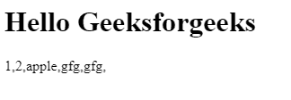

# 逻辑无效赋值？？=在 JavaScript 中

> 原文:[https://www . geesforgeks . org/logic-null ish-赋值 in-javascript/](https://www.geeksforgeeks.org/logical-nullish-assignment-in-javascript/)

这是 javascript 引入的新操作符。这个运算符用 **x 表示？？= y** ，称为逻辑零赋值运算符。只有当 **x** 的值为**null**时，y 的值才会赋给 **x** 即表示如果 x 的值为 **null** 或 **undefined** 则 y 的值会赋给 x。

**语法:**

```
x ??= y

Means : x ?? (x = y)
```

**例 1 :**

## java 描述语言

```
let x = 12;
let y = null;

let z = 13;

// The value of x will become 
// unchanged because x is not nullish.
x ??= z;

// The value of y will be 
// changed because y is nullish.
y ??= z;

console.log(x)    // 12
console.log(y)      // 13
```

**输出:**

```
12
13
```

**例 2 :**

## java 描述语言

```
let x = {
  name : "Ram"
}

// The value of name will remain
// unchanged because x.name is not nullish
x.name ??= "Shyam";

// There is no any property named age in object x .
// So the value of x.age will be 
// undefined and undefined means nullish.
// that's why the value of age will be assigned.
x.age ??= 18;

console.log(x.name)  // Ram
console.log(x.age)     // 18
```

**输出:**

```
"Ram"
18
```

**例 3:**

## 超文本标记语言

```
<!DOCTYPE html>
<html>
<head>
  <title>JS Bin</title>
</head>
<body>
  <h1>Hello Geeksforgeeks</h1>
  <p id="print_arr"></p>

  <script>

      let arr = [1, 2, "apple", null, undefined, []]

      // Replace each nullish values with "gfg"
      arr.forEach((item, index)=>{
        arr[index] ??= "gfg"
    })

    document.getElementById("print_arr")
      .innerText = arr.toString();
    //console.log(arr)
  </script>

</body>
</html>
```

**输出:**



#### 合理的看涨期权是如何运作的

让我们讨论一下这个逻辑零赋值运算符是如何工作的。首先我们都知道逻辑零赋值表示为 **x？？= y** ，这是由两个运算符[null sh 凝聚运算符](https://www.geeksforgeeks.org/javascript-nullish-coalescing-operator/)和赋值运算符推导出来的我们也可以把它写成 **x？？(x = y)** 。现在 javascript 先检查 **x** ，如果是**则取消**，然后将 **y** 的值赋给 **x** 。

#### 支持的浏览器

*   铬 85
*   边缘 85
*   Firefox 79
*   Safari 14