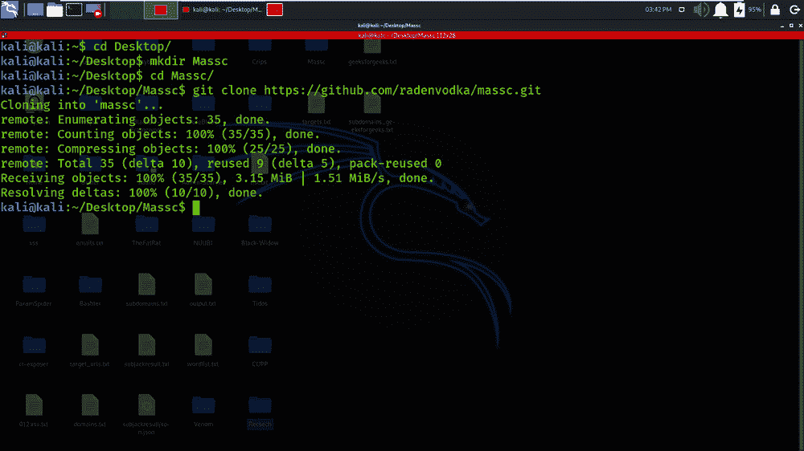
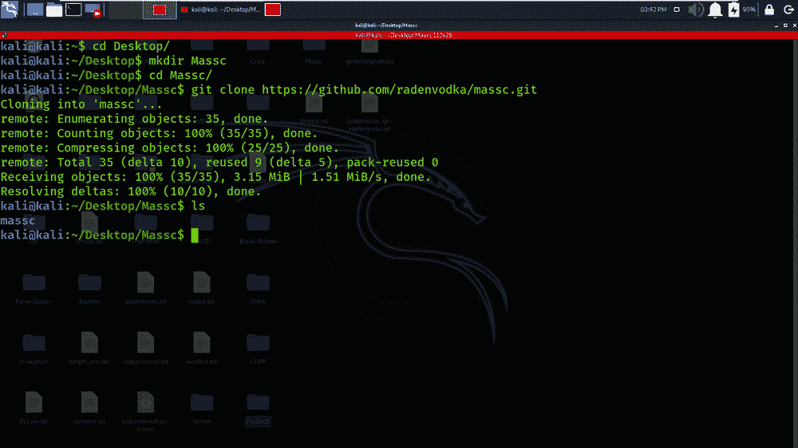
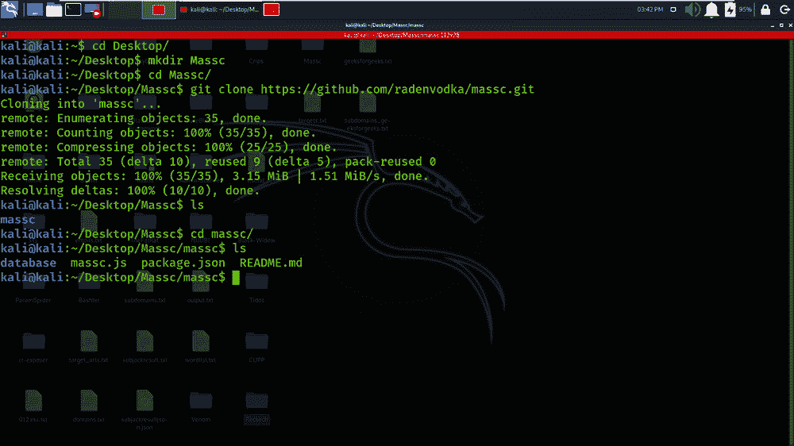
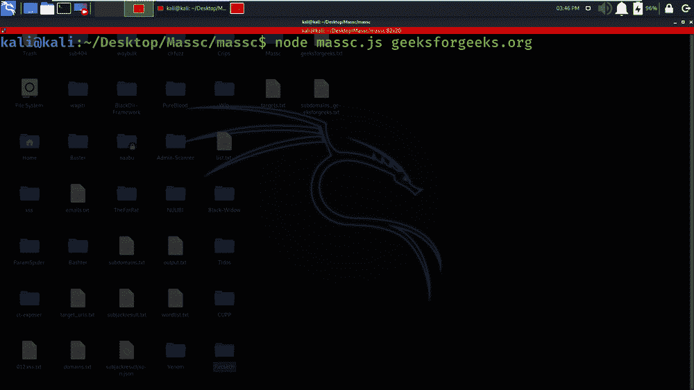
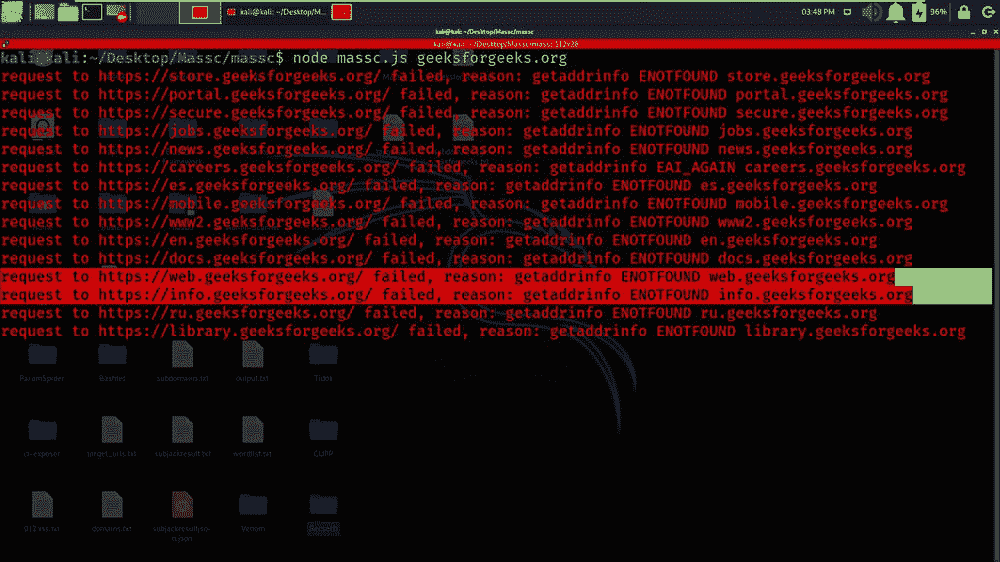
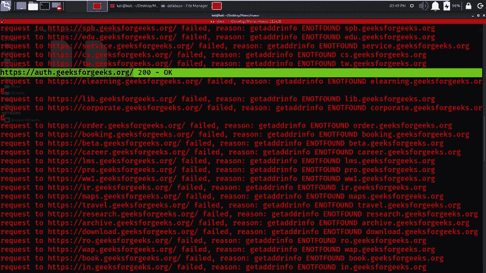
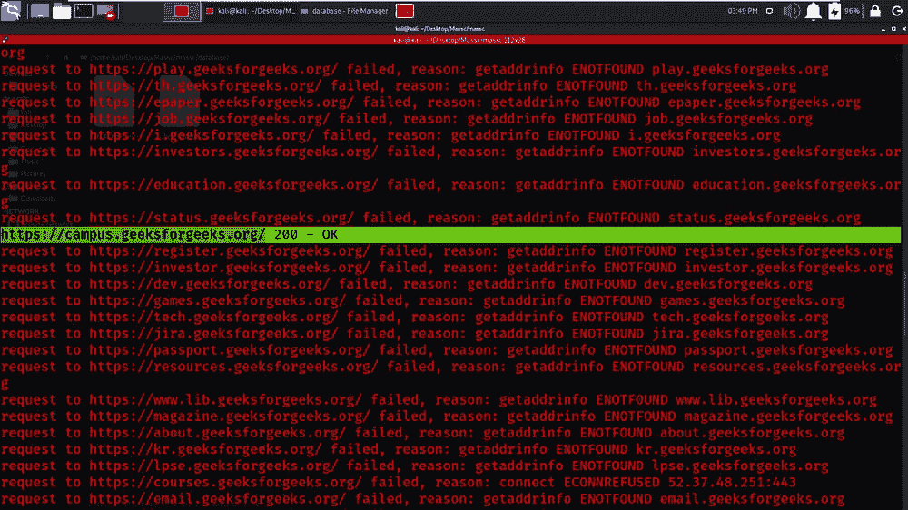
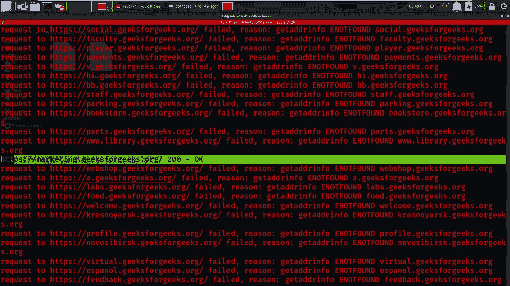

# Massc–用 JavaScript 设计的子域扫描工具

> 原文:[https://www . geesforgeks . org/massc-子域-扫描仪-工具-javascript 中设计/](https://www.geeksforgeeks.org/massc-subdomain-scanner-tool-designed-in-javascript/)

子域枚举是为一个或多个域查找有效(可解析)子域的过程。一般的系统是使用常用名称的字典，试图解析它们。这些检测到的子域可以揭示关于目标的重要信息，这些信息可能不在主域中。Massc 工具是一个基于 Nodejs 语言的工具，用于查找具有 200 个 OK 状态代码的子域。这个工具是一个开源工具，可以免费使用。Massc 工具强力-强制从默认单词列表中删除单词，并将请求发送到目标域 web 服务器，如果 web 服务器以标准响应服务请求，则该工具显示具有 200 OK 状态代码的子域，否则目标域服务器可能缺少指定的子域。

**Massc 工具的特性:**

1.  它枚举目标域的子域。
2.  它是用 Node.js 语言设计的。
3.  它使用单词表进行暴力破解并检测子域。
4.  它是开源的，可以自由使用该工具。
5.  它返回带有 200 个正常状态代码的子域。

**在 Kali Linux 操作系统上安装 Massc 工具:**确保您已经在系统上安装了 Node.js，因为这是一个基于 JavaScript 的工具。关于 node.js 的安装，查看 [**在 Linux 上安装 node . js**](https://www.geeksforgeeks.org/installation-of-node-js-on-linux/)的文章。

**步骤 1:** 检查 JS 环境是否建立，使用以下命令。

```
nodejs --version
```

**第二步:**打开你的 Kali Linux 终端，使用以下命令移动到桌面。

```
cd Desktop
```

**步骤 3:** 你在桌面上，现在使用以下命令创建一个名为 Massc 的新目录。在这个目录中，我们将安装 Massc 工具。

```
mkdir Massc 
```

**步骤 4:** 现在使用以下命令切换到 Massc 目录。

```
cd Massc
```

**第五步:**现在要安装工具了。你必须从 GitHub 克隆这个工具。

```
git clone https://github.com/radenvodka/massc.git
```



**第 6 步:**工具已在 Massc 目录下成功下载。现在使用下面的命令列出工具的内容。

```
ls
```



**步骤 7:** 您可以观察到，在我们安装 Massc 工具时，已经生成了该工具的新目录。现在使用下面的命令移动到该目录:

```
cd massc 
```

**第 8 步:**再次发现工具的内容，使用下面的命令。

```
ls
```



**第 9 步:**运行 massc.js 文件，目标域 URL 用于获取子域。

```
nodejs massc.js geeksforgeeks.org
```



**在 Kali Linux 操作系统上使用 Massc 工具:**

**示例:极客暴发户目标**

```
nodejs massc.js geeksforgeeks.org
```

在这个例子中，我们将检测或找到默认情况下由工具提供的 geeksforgeeks.org 表单单词表的子域。在下面的截图中，我们已经显示了内容或关键字，这些内容或关键字将被强行用于查找子域。


单词列表内容

在下面的截图中，您可以看到 Massc 工具向目标域发出请求，并检查用于查找子域的指定单词是否有任何责任。



尚未检测到子域

在下面的截图中，可以看到 geeksforgeeks.org 已经回应了 auth.geeksforgeeks.org 子域。这个子域实际上存在于 geeksforgeeks.org 服务器上。



检测到子域(1)

在下面的截图中，我们在 geeksforgeeks.org 服务器上检测到了 campus.geeksforgeeks.org 子域。



检测到子域(2)

在下面的截图中，我们在 geeksforgeeks.org 服务器上检测到了 marketing.geeksforgeeks.org 子域。



检测到子域(3)