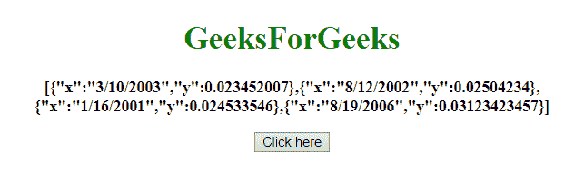
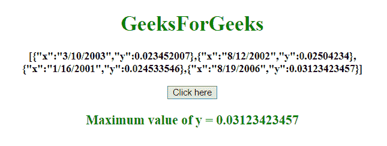
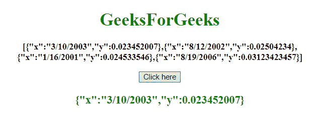

# JavaScript 中对象数组中属性的最大/最小值

> 原文:[https://www . geesforgeks . org/max-min-value-of-in-attribute-in-array-objects-in-JavaScript/](https://www.geeksforgeeks.org/max-min-value-of-an-attribute-in-an-array-of-objects-in-javascript/)

给定一个对象数组，任务是从对象数组中获取最大值和最小值。下面讨论使用的几种方法:

*   **Javascript apply() method:** It is write method which is used on different objects. This method is different from the function call() because of taking arguments as an array.

    **语法:**

    ```
    apply()
    ```

    **返回值:**返回给定函数的方法值。

*   **JavaScript Array map() Method:** This method is used to create a new array with the results of calling a function for each element of array. This method calls the given function once for each element in an array, in order.

    **语法:**

    ```
    array.map(function(cValue, index, arr), thisValue)
    ```

    **参数:**

    *   **函数(cValue，index，arr):** 必选参数。它是为数组中的每个元素运行的函数。
        *   **cvvalue:**必选参数。它指定当前元素的值。
        *   **指数:**为可选参数。它指定当前元素的数组索引。
        *   **arr:** 为可选参数。它指定当前元素所属的数组对象。
    *   **该值:**为可选参数。它指定要传递给函数的值，用作它的“this”值。如果不使用，值“undefined”将作为其“this”值传递。

    **返回值:**它返回一个数组，该数组具有为原始数组的每个元素调用提供的函数的结果。

*   **JavaScript Array reduce() Method:** This method reduces the array to a single value. This method runs a defined function for every value of the array (from left-to-right). The return value of the function is stored in an accumulator (result or total).

    **语法:**

    ```
    array.reduce(function(total, curValue, curIndex, arr), initialValue)

    ```

    **参数:**

    *   **函数(总计、曲线值、curIndex、arr):** 必选参数。它是为数组中的每个元素运行的函数。
        *   **总计:**必输参数。它指定 initialValue，或者函数先前返回的值。
        *   **曲线值:**必选参数。它指定当前元素的值。
        *   **curIndex:** 必选参数。它指定当前元素的数组索引。
        *   **arr:** 为可选参数。它指定当前元素所属的数组对象。
    *   **initialValue:** 可选参数。它指定要作为初始值传递给函数的值。

    **返回值:**返回回调函数最后一次调用的累计结果。

**示例 1:** 本示例使用 **apply()** 和 **map()** 方法获取 **y 属性**的最大值。

```
<!DOCTYPE HTML> 
<html> 
    <head> 
        <title> 
            Max value of an attribute in an array of objects
        </title>
    </head> 

    <body style = "text-align:center;"> 

        <h1 style = "color:green;" > 
            GeeksForGeeks 
        </h1> 

        <p id = "GFG_UP" style = "font-size: 16px; font-weight: bold;">
        </p>

        <button onclick = "gfg_Run()"> 
            Click here
        </button>

        <p id = "GFG_DOWN" style = 
            "color:green; font-size: 20px; font-weight: bold;">
        </p>

        <script>
            var el_up = document.getElementById("GFG_UP");
            var el_down = document.getElementById("GFG_DOWN");

            var array = [
                { "x": "3/10/2003", "y": 0.023452007 }, 
                { "x": "8/12/2002", "y": 0.02504234 }, 
                { "x": "1/16/2001", "y": 0.024533546 },
                { "x": "8/19/2006", "y": 0.03123423457 }];

            el_up.innerHTML = JSON.stringify(array);

            function gfg_Run() {
                el_down.innerHTML = "Maximum value of y = " + 
                Math.max.apply(Math, array.map(function(o) {
                    return o.y; 
                }));
            }         
        </script> 
    </body> 
</html>                    
```

**输出:**

*   **点击按钮前:**
    
*   **点击按钮后:**
    

**示例 2:** 本示例使用 **array.reduce()** 方法获取 **y 属性**的最小值。它返回整个对象。

```
<!DOCTYPE HTML> 
<html> 
    <head> 
        <title> 
            Min value of an attribute in an array of objects
        </title>
    </head> 

    <body style = "text-align:center;"> 

        <h1 style = "color:green;" > 
            GeeksForGeeks 
        </h1> 

        <p id = "GFG_UP" style = "font-size: 16px; font-weight: bold;">
        </p>

        <button onclick = "gfg_Run()"> 
            Click here
        </button>

        <p id = "GFG_DOWN" style = 
            "color:green; font-size: 20px; font-weight: bold;">
        </p>

        <script>
            var el_up = document.getElementById("GFG_UP");
            var el_down = document.getElementById("GFG_DOWN");

            var array = [
                { "x": "3/10/2003", "y": 0.023452007 }, 
                { "x": "8/12/2002", "y": 0.02504234 }, 
                { "x": "1/16/2001", "y": 0.024533546 }, 
                { "x": "8/19/2006", "y": 0.03123423457 }];

            el_up.innerHTML = JSON.stringify(array);

            function gfg_Run() {
                el_down.innerHTML = 
                JSON.stringify(array.reduce(function(prev, current) {
                    return (prev.y < current.y) ? prev : current
                }));
            }         
        </script> 
    </body> 
</html>                    
```

**输出:**

*   **点击按钮前:**
    
*   **点击按钮后:**
    