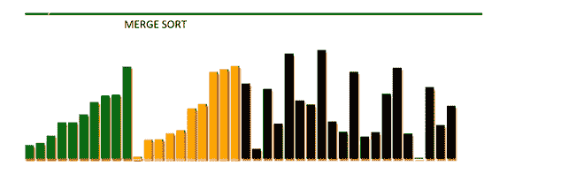
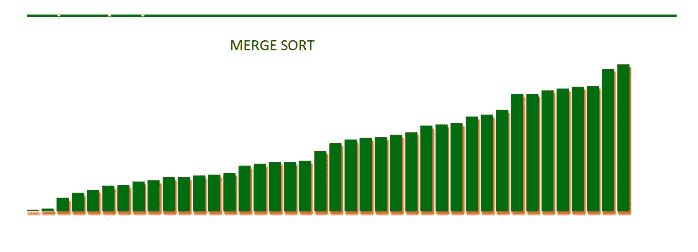

# 在 JavaScript 中合并排序可视化

> 原文:[https://www . geesforgeks . org/merge-sort-visualization-in-JavaScript/](https://www.geeksforgeeks.org/merge-sort-visualization-in-javascript/)

**GUI(图形用户界面)**帮助用户更好地理解程序。在本文中，我们将使用 JavaScript 可视化**合并排序**。我们将看到数组在排序后如何被划分和合并，以获得最终的排序数组。

**参考:**

*   [合并排序](https://www.geeksforgeeks.org/merge-sort/)
*   [HTML 中的画布](https://www.geeksforgeeks.org/html-canvas-basics/)
*   [JavaScript 中的异步函数](https://www.geeksforgeeks.org/how-to-create-an-asynchronous-function-in-javascript/)

**进场:**

*   首先，我们将使用[数学生成一个随机数组。random()](https://www.geeksforgeeks.org/javascript-math-random-method/) 功能。
*   [画布](https://www.geeksforgeeks.org/html-canvas-basics/)的属性用于制作矩形条和动画。
*   不同的颜色用于指示哪些数组被划分和合并。
*   使用 JavaScript **mergeSort()** 函数执行排序。
*   算法执行操作非常快，**超时()**功能已用于减慢进程。

**未排序列表:**



**排序列表:**



**index.html:** 下面是可视化[合并排序算法的程序。](https://www.geeksforgeeks.org/merge-sort/)

## 超文本标记语言

```html
<!DOCTYPE html>
<html lang="en">

<head>
    <meta charset="UTF-8">
    <meta name="viewport" content="width=device-width,
    initial-scale=1.0">   
</head>

<body>
    <h1 class="title" style = "color: green; font:lighter; ">
        Merge Sort Visualizer using JS</h1>

    <h2 class="title1" style = "background: green;
    color: white;  font: italic;">Array is not sorted
    </h2>

    <canvas id="Canvas"></canvas>

    <script src="mergeSort.js"></script>
</body>

</html>
```

**mergeSort.js** :以下是上述 HTML 代码中使用的“mergeSort.js”文件的内容。

## java 描述语言

```html
// Canvas variables
var canvas, canvaswidth, canvasheight, ctrl;

// Call canvasElements() to store height width
// in above canvas variables
canvasElements();

// 3 array are declared

//1) arr is for storing array element
//2) itmd for storing intermediate values
//3) visited is for element which has been sorted
var arr = [], itmd = [], visited = []

// Length of unsorted array
var len_of_arr = 40;

// Store random value in arr[]
for (var i = 0; i < len_of_arr; i++) {
    arr.push(Math.round(Math.random() * 250) )
}

// Initialize itmd and visited array with 0
for (var i = 0; i < len_of_arr; i++) {
    itmd.push(0)
    visited.push(0)
}

// Merging of two sub array
// https://www.geeksforgeeks.org/merge-two-sorted-arrays/
function mergeArray(start, end) {
    let mid = parseInt((start + end) >> 1);
    let start1 = start, start2 = mid + 1
    let end1 = mid, end2 = end

    // Initial index of merged subarray
    let index = start

    while (start1 <= end1 && start2 <= end2) {
        if (arr[start1] <= arr[start2]) {
            itmd[index] = arr[start1]
            index = index + 1
            start1 = start1 + 1;
        }
        else if(arr[start1] > arr[start2]) {
            itmd[index] = arr[start2]
            index = index + 1
            start2 = start2 + 1;
        }
    }

    // Copy the remaining elements of
    // arr[], if there are any
    while (start1 <= end1) {
        itmd[index] = arr[start1]
        index = index + 1
        start1 = start1 + 1;
    }

    while (start2 <= end2) {
        itmd[index] = arr[start2]
        index = index + 1
        start2 = start2 + 1;
    }

    index = start
    while (index <= end) {
        arr[index] = itmd[index];
        index++;
    }
}

// Function for showing visualization
// effect
function drawBars(start, end) {

    // Clear previous unsorted bars
    ctrl.clearRect(0, 0, 1000, 1500)

    // Styling of bars
    for (let i = 0; i < len_of_arr; i++) {

        // Changing styles of bars
        ctrl.fillStyle = "black"
        ctrl.shadowOffsetX = 2
        ctrl.shadowColor = "chocolate";
        ctrl.shadowBlur = 3;
        ctrl.shadowOffsetY =5;

        // Size of rectangle of bars
        ctrl.fillRect(25 * i, 300 - arr[i], 20, arr[i])

        if (visited[i]) {
            ctrl.fillStyle = "#006d13"
            ctrl.fillRect(25 * i, 300 - arr[i], 20, arr[i])
            ctrl.shadowOffsetX = 2
        }
    }

    for (let i = start; i <= end; i++) {
        ctrl.fillStyle = "orange"
        ctrl.fillRect(25 * i, 300 - arr[i], 18, arr[i])
        ctrl.fillStyle = "#cdff6c"
        ctrl.fillRect(25 * i,300, 18, arr[i])
        visited[i] = 1
    }
}

// Waiting interval between two bars
function timeout(ms) {
    return new Promise(resolve => setTimeout(resolve, ms));
}

// Merge Sorting
const mergeSort = async (start, end) => {
    if (start < end) {
        let mid = parseInt((start + end) >> 1)
        await mergeSort(start, mid)
        await mergeSort(mid + 1, end)
        await mergeArray(start, end)
        await drawBars(start, end)

        // Waiting time is 800ms
        await timeout(800)
    }
}

// canvasElements function for storing
// width and height in canvas variable
function canvasElements() {
    canvas = document.getElementById("Canvas")
    canvas.width = canvas.height = 1000
    canvaswidth = canvas.width
    canvasheight = canvas.height
    ctrl = canvas.getContext("2d")
}

// Asynchronous MergeSort function
const performer = async () => {
    await mergeSort(0, len_of_arr - 1)
    await drawBars()

    // Code for change title1 text
    const title1_changer = document.querySelector(".title1")
    title1_changer.innerText = "Array is completely sorted"
}
performer()
```

**输出:**

<video class="wp-video-shortcode" id="video-557366-1" width="640" height="360" preload="metadata" controls=""><source type="video/mp4" src="https://media.geeksforgeeks.org/wp-content/uploads/20210209234048/InShot_20210209_233841711.mp4?_=1">[https://media.geeksforgeeks.org/wp-content/uploads/20210209234048/InShot_20210209_233841711.mp4](https://media.geeksforgeeks.org/wp-content/uploads/20210209234048/InShot_20210209_233841711.mp4)</video>