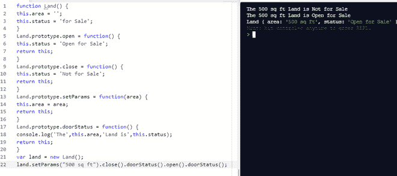

# JavaScript 中的方法链接

> 原文:[https://www . geesforgeks . org/method-chaining-in-JavaScript/](https://www.geeksforgeeks.org/method-chaining-in-javascript/)

作为一个好的编程实践，我们应该编写单独的函数/方法来处理单独的动作。而且，为所有动作只编写一个方法/函数是一件事。然而，坚持良好的实践会对代码的可读性和可理解性造成损害，因为为每个操作定义单独的函数意味着输入单个函数/方法的输出。这使得代码的可理解性更差，因为函数需要以相反的顺序嵌套。这就是方法链拯救的地方。

**方法链接**是一种简化和修饰代码的编程策略。它是在同一对象的另一个方法上调用一个方法的机制。

**JavaScript 中的这个**关键字指的是当前调用它的对象。因此，当一个方法返回**这个**时，它只是返回它所返回的对象的一个实例。由于返回值是一个对象的实例，因此可以调用一个对象的另一个方法来获取返回值，这就是它的实例。这使得 JavaScript 中的方法链接成为可能。

**示例:**在本例中，Land.prototype 中的每个方法都返回**这个**，它指的是该 Land 对象的整个实例。这将有助于在同一对象的另一个方法上调用一个方法。

## java 描述语言

```
//creating a function Land()
function Land() {
this.area = '';
this.status = 'for Sale';
}
//Setting status open for sale
Land.prototype.open = function() {
this.status = 'Open for Sale';
return this;
}
//Setting status not for sale
Land.prototype.close = function() {
this.status = 'Not for Sale';
return this;
}
//Setting Parameters
Land.prototype.setParams = function(area) {
this.area = area;
return this;
}
//printing land status
Land.prototype.doorStatus = function() {
console.log('The',this.area,'Land is',this.status);
return this;
}
//creating a land object
var land = new Land();
land.setParams("500 sq ft").close().doorStatus().open().doorStatus();
```

**输出:**

> 这块 500 平方英尺的土地不出售
> 
> 这块 500 平方英尺的土地公开出售
> 
> 土地{面积:500 平方英尺，状态:公开出售}

