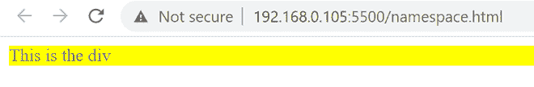
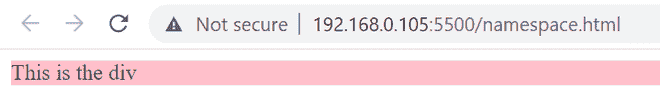

# JavaScript 中的名称间距

> 原文:[https://www.geeksforgeeks.org/namespacing-in-javascript/](https://www.geeksforgeeks.org/namespacing-in-javascript/)

默认情况下，JavaScript 缺少名称空间，但是，我们可以使用对象来创建名称空间。嵌套命名空间是另一个命名空间内的命名空间。在 JavaScript 中，我们可以通过在另一个对象中创建一个对象来定义嵌套的命名空间。

**[JavaScript Namespace:](https://www.geeksforgeeks.org/javascript-namespace/)**Namespace 是指为标识符(类型、函数、变量等的名称)提供范围以防止它们之间冲突的编程范式。例如，在不同的上下文中，程序可能需要相同的变量名。

**示例:**一个 HTML 文件，其中我们调用了两个 JavaScript 文件，namespace1.js 和 namespace2.js，其中。

*   **namespace1.js** 处理将鼠标指针指向< div >元素时将背景颜色更改为“黄色”并将文本颜色更改为“灰色”的事件。

*   **namespace2.js** 处理将鼠标指针从< div >元素移开时将背景颜色更改为“粉色”并将文本颜色更改为“木炭色”的事件。

## 超文本标记语言

```
<!DOCTYPE html>
<html>
 <head>
  <meta charset="UTF-8" />
  <title>Namespacing in JavaScript</title>
 </head>
 <body>
    <div id="output">This is the div</div>

    <script src="./namespace1.js"></script>
    <script src="./namespace2.js"></script>
 </body>
</html>
```

## namespace1.js

```
let MAC = {
    colorDiv: function(ev){
        let target = ev.currentTarget;
        target.style.backgroundColor = 'yellow';
        target.style.color = '#808080';
    }, 
    init: function(){
        let divA = document.getElementById('output');
        divA.addEventListener('mouseover',
        MAC.colorDiv);
    }
}

MAC.init();
```

## namespace2.js

```
let WIN = {
    colorDiv: function(ev){
        let target = ev.currentTarget;
        target.style.backgroundColor = 'pink';
        target.style.color = '#36454F';
    }, 
    init: function(){
        let divB = document.getElementById('output');
        divB.addEventListener('mouseout',
        this.colorDiv);
    }
}

WIN.init();
```

**输出:**

*   将鼠标指针指向

    元素。

    

*   将鼠标指针从

    元素移开。

    

如果不使用名称空间，则会出现在两个或多个 JavaScript 文件中使用相同函数的错误，因为 JavaScript 中的函数是全局声明的。在我们的例子中，“colorDiv”函数在 namespace1.js 和 namespace2.js 中都使用了。如果在上面的例子中没有使用名称空间，那么它将抛出一个错误:“uncathed SyntaxError:标识符“colorDiv”已经在 namespace2.js 中声明了”。